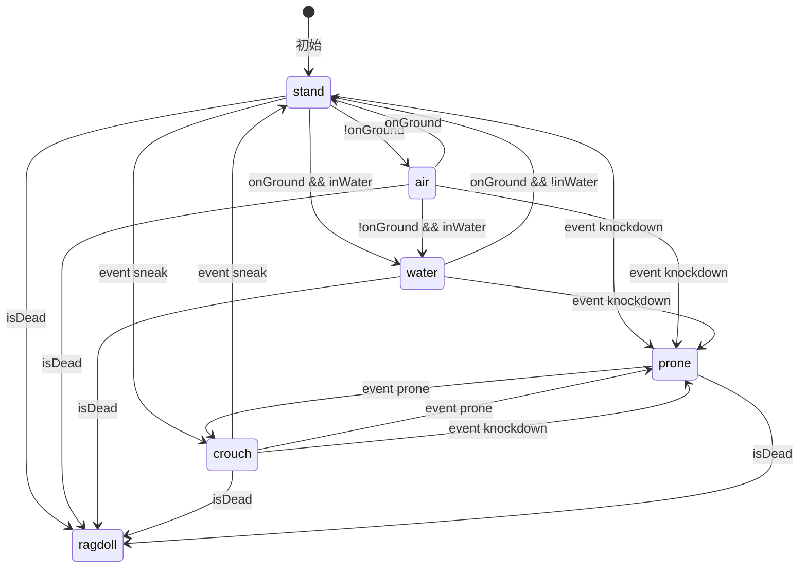
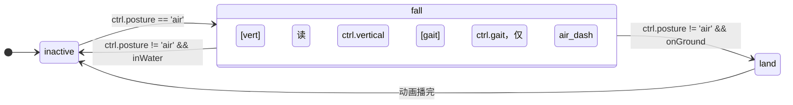

# ARMS-Core 分层控制器与动画状态机设计

> **状态**: 草案 · **创建**: 2026-07-01 · **修订**: 2026-07-04\
> **关联**: Spark-Core `state_variable_and_multianim_plan.md` · 总体设计文档.md · MechaControl设计文档.md

***

## 目录

1. [核心问题](#1-核心问题)
2. [概念总览](#2-概念总览)
3. [MechaControl — 唯一编排器](#3-mechacontrol--唯一编排器)
4. [双层架构：逻辑层与表现层](#4-双层架构逻辑层与表现层)
   - [4.1 逻辑层 — KCC 物理控制](#41-逻辑层--kcc-物理控制)
   - [4.2 表现层 — 动画广播](#42-表现层--动画广播)
   - [4.3 覆盖层 — 手臂/持物/挥动](#43-覆盖层--手臂持物挥动)
5. [默认动画三级回退](#5-默认动画三级回退)
6. [分组广播与 AnimGroup 分层覆盖](#6-分组广播与-animgroup-分层覆盖)
7. [帧首数据流](#7-帧首数据流)
8. [硬编码入口 vs JSON 入口](#8-硬编码入口-vs-json-入口)
9. [MoLang 集成 (ctrl.xxx + 接口组合)](#9-molang-集成-ctrlxxx--接口组合)
10. [动画完成查询](#10-动画完成查询)

***

## 1. 核心问题

机娘由**多个独立渲染的 SubPart**（躯干、四肢、武器等）组成，每个拥有独立的 `IAnimatable` 和 `AnimController`。

| 需求      | 例子                                  |
| ------- | ----------------------------------- |
| 全局同步动作  | 行走、跑步、跳跃、死亡 — 所有零件同时切换              |
| 局部独立动作  | 武器开火 — 只影响特定零件，多个武器可同时处于不同状态        |
| 广播范围可变  | locomotion 全身，hold 只播手臂，swing 只播挥动臂 |
| 分层覆盖    | 行走摆臂被持剑动画覆盖，持剑被挥动覆盖                 |
| 默认动画回退  | 零件未做 walk 动画时，用素体/Mod内置默认           |
| UGC 可定制 | `animation_controllers.json` 覆盖默认行为 |
| 对齐 YSM  | `ctrl.xxx` MoLang 命名，降低迁移成本         |

***

## 2. 概念总览

MechaControl 持有 **逻辑层** `MechaLogicStateMachine`（继承 `StateGraphController`），内含：

```
┌──────────────────────────────────────────────────────────────┐
│ 逻辑层（Logic Layer）—— 已实现                                  │
│ • MechaLogicStateMachine extends StateGraphController            │
│ • 硬编码图（PostureLogicGraphs / GaitSubGraphs /               │
│   VerticalSubGraphs），不可自定义                               │
│ • 即时切换，无过渡——设计根本原则                                 │
│ • 控制 KCC 物理参数：胶囊尺寸、跳跃开关、速度上限、步高等         │
│ • 产出：POSTURE / GAIT / VERTICAL 枚举 → StateVariableContainer│
│                                                              │
│   顶层 posture: stand / air / water / crouch / prone / ragdoll│
│   子控 (children，进入对应 posture 节点时自动激活):              │
│     stand_gait (idle/creep/jog/sprint/drift/dodge/stun/       │
│                 hard_land)                                    │
│     stand_vert (ground / jump_charge)                         │
│     air_gait   (idle/creep/jog/sprint/drift/dodge/stun)    │
│     air_vert   (fall / glide / hover / fly)                   │
│     water_gait (idle/creep/jog/sprint/drift/dodge/stun)       │
│     crouch_gait(idle/creep/jog/sprint/drift/dodge/stun)       │
│     prone_gait (idle/creep/jog/drift/dodge/stun)              │
│   模式 flag:     enable_drive（不是 posture，任意姿势下可用）    │
├──────────────────────────────────────────────────────────────┤
│ 表现层（Presentation Layer）—— 规划中，暂未实现                  │
│ • MultiAnimStateMachine × N（每种 posture 一台，全部并行推进）  │
│ • 消费 StateVariableContainer 中的条件                         │
│   覆盖层（独立，更高 AnimGroup）：                              │
│     hold_mainhand / hold_offhand / swing / use                │
├──────────────────────────────────────────────────────────────┤
│ 本地状态机（Local Layer）—— 规划中，暂未实现                     │
│ • AnimStateMachine（1:1），挂在各 SubPart 的 AnimController     │
│ • 事件驱动（triggerEvent），零件自主动作（武器开火等）            │
└──────────────────────────────────────────────────────────────┘
```

**核心原则**：

1. **逻辑管物理，表现管动画** — 逻辑层决定"能做什么"（能不能跳、多高多快），表现层决定"看起来什么样"
2. **逻辑层不可自定义** — 安全边界，确保 KCC 行为不受 UGC 破坏；表现层可整体替换
3. **同一数据源** — StateVariableContainer 同时服务逻辑层转移条件、表现层转移条件、MoLang 查询

***

## 3. MechaControl — 唯一编排器

```java
public class MechaControl {
    // 物理控制器（已有）
    MechaCharacter kcc;

    // ══ 逻辑层 ══
    /** 共享变量容器（由 MechaControl 创建，表现层也共用） */
    StateVariableContainer variables;

    /** 共享标签容器 */
    GameplayTagContainer tags;

    /** 逻辑层控制器（继承 StateGraphController，含 posture 顶层 + 7 个子控） */
    MechaLogicStateMachine logic;

    /** 模式 flag（不是 posture 状态），事件 TOGGLE_DRIVE 控制 */
    volatile boolean enableDrive;

    // ══ 表现层（规划中，暂未实现）════
    // Map<String, MultiAnimStateMachine> postureMachines;
    // Map<String, MultiAnimStateMachine> overlayMachines;

    /** 帧快照 */
    MechaConditionSnapshot snapshot;
}
```

**每物理步进**（当前已实现部分）：

```
1. 消费输入 → kcc.setMoveInput / setJumpInput
2. snapshot 采集 → 汇入 variables
   variables.set(ON_GROUND,        snapshot.onGround)
   variables.set(HAS_INPUT,        snapshot.hasInput)
   variables.set(WALK_KEY_DOWN,    snapshot.walkKeyDown)
   variables.set(IN_WATER,         snapshot.inWater)
   // ...

3. 注入离散事件（来自 pendingEvents）
   if (pendingEvents.contains(TOGGLE_SNEAK)) logic.triggerEvent("sneak")
   if (pendingEvents.contains(TOGGLE_PRONE)) logic.triggerEvent("prone")
   if (pendingEvents.contains(DODGE))        logic.triggerEvent("dodge")
   if (pendingEvents.contains(TOGGLE_FLY))   logic.triggerEvent("fly")
   if (pendingEvents.contains(KNOCKDOWN))    logic.triggerEvent("knockdown")

4. 逻辑层推进
   logic.progress()  // 递归驱动 posture 顶层 + 活跃子控（gait/vert）
   → 写入 variables: POSTURE / GAIT / VERTICAL 枚举
   → MOVE_SPEED_MODIFIER（KCC 直接读取）
   → CAN_MOVE / CAN_JUMP / IS_STUNNED 等派生布尔
   → 对应 KCC 胶囊/速度/跳跃参数即时生效

5. 读取产出变量
   Posture posture = variables.get(POSTURE)
   Gait    gait    = variables.get(GAIT)
   Vertical vert   = variables.get(VERTICAL)

6. （以下为规划中步骤，暂未实现）
   // 5'. 注入 MoLang → molangContext.setVariables(variables)
   // 6.  表现层推进 → postureMachines.forEach { it.progress() }
   // 7.  覆盖层推进 → overlayMachines.forEach { it.progress() }
   // 8.  提取动画根位移 + Y 轴旋转 → kcc.setAnimRootDelta / setAnimRootYawDelta
7. kcc.prePhysicsTick(physicsSpace)
```

***

## 4. 双层架构：逻辑层与表现层

动画状态机不应该直接控制 KCC 物理参数（胶囊尺寸、跳跃开关等）。将两者分离：

- **逻辑层**：Spark-Core `StateGraphController`，硬编码不可自定义。控制 KCC，即时切换无过渡。
- **表现层**：`MultiAnimStateMachine`，默认硬编码可整体替换。驱动动画广播，有过渡混合。

### 4.1 逻辑层 — KCC 物理控制

#### 4.1.1 状态图



> **注意**：以上为转移关系概览。具体的转移条件（如 `COND_KNOCKDOWN = isTrue(EVENT_KNOCKDOWN)`）以实际代码
> [`PostureLogicGraphs.java`](file:///d:/Files/Project_MinecraftMods/ARMS-Core/src/main/java/io/github/sweetzonzi/arms_core/common/control/state/preset/PostureLogicGraphs.java) 为准。

**即时切换，无过渡**：逻辑层全部转移条件仅依赖 KCC 状态和环境条件，转移瞬间完成——这是逻辑状态机的根本设计原则。表现层负责动画过渡和收尾。

`air → stand` 的条件为 `onGround` — 脚着地的那帧 posture 立即切回 stand，KCC 落地参数同步生效。（未来表现层 air 机检测到 `ctrl.posture == 'stand'` 时自动进入 `land` 过渡动画。）

`air → water` 的触发条件：`!onGround && inWater`。逻辑层即时切换，表现层 air 机后续自然停止输出。

**knockdown → prone**：从任意非 ragdoll 姿态被击倒时强制转入 prone，后续 gait 子机配合 `IS_KNOCKED_DOWN` 标记执行起身动画。

**死亡 → ragdoll**：任意姿势下均可被 `isDead` 条件转入 ragdoll。包括空中死亡、水中死亡等——不做区分，统一进入布娃娃。ragdoll 是终态，无出口转移。

#### 4.1.2 KCC 控制表

| 逻辑状态    |  胶囊高 |  跳跃 |  行走速度 |  步高  | enable_drive 行为 |
| ------- | :--: | :-: | :---: | :--: | ---------------- |
| stand   | 1.8m |  ✓  |  见 gait 倍率 | 0.6m | XZ解锁，Y单向弹簧       |
| crouch  | 1.2m |  ✗  |  0.3× | 0.3m | 同上               |
| prone   | 0.6m |  ✗  |  0.1× | 0.1m | 同上               |
| air     | 1.8m |  ✗  | 0.05× |   —  | 空中几乎无地面摩擦        |
| water   | 1.8m |  ✗  |  0.5× |   —  | Y自由，浮力接管         |
| ragdoll |   —  |  ✗  |   0   |   —  | 约束全解，不适用         |

> stand 的行走速度受 `MOVE_SPEED_MODIFIER` 倍率调制：creep=0.4×（慢走须单独按键）、jog=1.0×（默认慢跑）、sprint=1.6×（消耗能量）。最终倍率 = posture.speedModifier × gait.baseSpeedModifier。

#### 4.1.3 `enable_drive` — 模式 flag，不是 posture

`enable_drive` 由事件 `TOGGLE_DRIVE` 控制，是一个独立的布尔 flag（`MechaStateVariableKeys.ENABLE_DRIVE`）。
任意 posture 下均可生效——站立、空中、水中都可以切 drive。
KCC 每帧读取此 flag 切换约束行为，不影响 posture 状态机归属。

#### 4.1.4 逻辑层子机 — gait / vertical

逻辑层不只是 posture 互斥切换。每个 posture 节点进入时自动激活对应的子状态机（children），离开时自动关闭。子机统一使用 Spark-Core `StateGraphController` 建图，共享同一个 `StateVariableContainer`。

子机产出 `GAIT` / `VERTICAL` 枚举、`MOVE_SPEED_MODIFIER` 浮点、`CAN_MOVE` / `CAN_JUMP` / `IS_STUNNED` 等派生布尔，KCC 和表现层直接读取而无需重复判断条件。

##### gait 子机

gait 描述**水平移动模式**——是所有 posture 共用的通用词表，不限于地面移动。"walk/run" 的语义过于地面化，因此拆分为更通用的状态：

| gait 状态 | 基础倍率 | 触发条件 | 说明 |
|-----------|:-----:|---------|------|
| idle | 0 | 无移动输入 | 静止 |
| creep | 0.4× | 有输入 + walk 键按下 | 低速精细移动（蹲走、匍匐、慢游、空中微调） |
| jog | 1.0× | 有输入（默认） | 常速移动（慢跑、游泳、空中转向） |
| sprint | 1.6× | sprint 键 + 能量>0 | 高速移动，消耗能量 |
| drift | 0 | 无输入但有残余水平速度 | 惯性滑行（冰面、松键减速期） |
| dodge | — | 事件 DODGE | 冲量驱动 + 短暂无敌帧（翻滚、推进器、空中 dash） |
| stun | 0 | 受击 | 硬直，禁止水平输入，重力正常 |
| hard_land | 0 | 高坠落着地 | 重落地恢复动画，禁止输入，可被 dodge 取消 |

> **命名说明**：creep/jog 替代了早期设计中的 walk/run，因为 walk/run 的语义太"地面化"。实际实现中结合 posture 和 gait 共同判断行为——例如 `air + jog` 是空中常速转向，`water + sprint` 是冲刺游泳。

**各 posture 的 gait 适用范围**（实现见 [`GaitSubGraphs.java`](file:///d:/Files/Project_MinecraftMods/ARMS-Core/src/main/java/io/github/sweetzonzi/arms_core/common/control/state/preset/GaitSubGraphs.java)）：

| posture | idle | creep | jog | sprint | drift | dodge | stun | hard_land |
|---------|:----:|:-----:|:---:|:------:|:-----:|:-----:|:----:|:---------:|
| stand   | ✓ | ✓ | ✓ | ✓ | ✓ | ✓ | ✓ | ✓ |
| air     | ✓ | ✓ | ✓ | ✓ | ✓ | ✓ | ✓ |   |
| water   | ✓ | ✓ | ✓ | ✓ | ✓ | ✓ | ✓ |   |
| crouch  | ✓ | ✓ | ✓ | ✓ | ✓ | ✓ | ✓ |   |
| prone   | ✓ | ✓ | ✓ |   | ✓ | ✓ | ✓ |   |

**速度倍率计算公式**：

```
MOVE_SPEED_MODIFIER = posture.speedModifier() × gait.baseSpeedModifier()
```

例如：crouch(0.3) + creep(0.4) → 0.12，stand(1.0) + sprint(1.6) → 1.6。
KCC 每帧读取 `MOVE_SPEED_MODIFIER`，无需关心 posture 或 gait 名称。

**转移条件**：实际转移条件以代码中的 `SimpleVariableCondition` 工厂方法为准（`isTrue(HAS_INPUT)`、`isFalse(WALK_KEY_DOWN)` 等）。部分条件目前标注了 TODO（如 drift → idle 需用 `horizontal_speed ≈ 0` 替代 `COND_NO_INPUT`，stun / hard_land 退出需用计时器条件）。

##### vertical 子机（仅 stand / air）

逻辑状态机的根本设计原则是**即时切换，体现持续性状态**。jump 和 fall 语义上差异不大（仅有速度方向区别），因此在逻辑层统一为 `fall`。上升/下降的区分移交给表现层通过 `verticalSpeed` 变量自行选择动画。

Vertical 枚举值及归属：

| vertical | 归属 posture | 说明 |
|----------|:----------:|------|
| ground | stand | 着地，正常站立/蹲伏/卧倒 |
| jump_charge | stand | 跳跃蓄力中（按住跳跃键，降低移动速度） |
| fall | air | **自然摔落**——空中无推力阶段的上升与下落统一 |
| glide | air | 鞘翅滑翔——减重力 + 俯仰→升力转换，需水平速度 |
| hover | air | 推进悬浮——持续推力平衡重力，可水平移动，消耗能量 |
| fly | air | 创造飞行——6DOF 自由垂直控制 |

**stand 的 vertical**（实现见 [`VerticalSubGraphs.STAND`](file:///d:/Files/Project_MinecraftMods/ARMS-Core/src/main/java/io/github/sweetzonzi/arms_core/common/control/state/preset/VerticalSubGraphs.java)）：

```
ground ──(event:jump_start)──▶ jump_charge
jump_charge ──(event:jump_release)──▶ ground
jump_charge ──(onGround)──▶ ground（离地前松开取消跳跃）
```

ground 进入时写入 `enableInput()`（恢复 CAN_MOVE/CAN_JUMP）；jump_charge 进入时写入 `disableMove()` + `disableJump()`。离地后 posture 切 air，stand_vert 子机自然停用。

**air 的 vertical**（实现见 [`VerticalSubGraphs.AIR`](file:///d:/Files/Project_MinecraftMods/ARMS-Core/src/main/java/io/github/sweetzonzi/arms_core/common/control/state/preset/VerticalSubGraphs.java)）：

```
fall ──(event:glide_activate)──▶ glide ──(event:glide_deactivate)──▶ fall
fall ──(event:hover)───────────▶ hover ──(event:hover)──────────────▶ fall
fall ──(event:fly)─────────────▶ fly ──(event:fly)──────────────────▶ fall
glide ──(event:hover)─────────▶ hover
glide ──(event:fly)───────────▶ fly
hover ──(event:fly)───────────▶ fly
```

默认初始态为 fall。glide（鞘翅滑翔）兼容原版鞘翅行为，也服务于操控模式类似固定翼的机娘。hover（推进悬浮）期间 KCC 获得向上推力。fly 为 6DOF 自由模式。

> **注意**：crouch/prone 由于跳跃被禁用，没有 vertical 子机。water 不受重力约束，也没有 vertical 子机。

##### 逻辑层写入的完整变量

逻辑层除了三大枚举外，还写入一系列表现层便利布尔和派生布尔。完整定义见 [`MechaStateVariableKeys.java`](file:///d:/Files/Project_MinecraftMods/ARMS-Core/src/main/java/io/github/sweetzonzi/arms_core/common/control/state/MechaStateVariableKeys.java)。

| 类别 | 变量键 | 类型 | 说明 |
|------|--------|------|------|
| 逻辑层产出 | `POSTURE` | enum | stand / air / water / crouch / prone / ragdoll |
| 逻辑层产出 | `GAIT` | enum | idle / creep / jog / sprint / drift / dodge / stun / hard_land |
| 逻辑层产出 | `VERTICAL` | enum | ground / jump_charge / fall / glide / hover / fly |
| 模式 flag | `ENABLE_DRIVE` | boolean | 驾驶模式开关 |
| KCC 可读 | `MOVE_SPEED_MODIFIER` | float | 0.0~1.8，KCC 直接读取 |
| KCC 可读 | `ENERGY` | float | 当前能量值 |
| 派生 | `CAN_MOVE` | boolean | 是否允许水平移动输入 |
| 派生 | `CAN_JUMP` | boolean | 是否允许跳跃输入 |
| 派生 | `IS_MOVING` | boolean | 正在自主移动 |
| 派生 | `IS_STUNNED` | boolean | 硬直中 |
| 派生 | `IS_KNOCKED_DOWN` | boolean | 被击倒 |
| 快照 | `HAS_INPUT` | boolean | 是否有移动输入 |
| 快照 | `WALK_KEY_DOWN` | boolean | 慢走键是否按住 |
| 快照 | `IN_WATER` | boolean | 眼部位置浸水 |
| 事件 latch | `EVENT_DODGE` 等 | boolean | 本帧离散事件标记 |
| one-hot | `IS_STANDING` / `IS_CREEPING` / `IS_FALLING` 等 | boolean | 表现层直接查询，无需枚举比较 |

表现层子机直接读这些变量决定动画切换，不需要重复判断条件。

***

### 4.2 表现层 — 动画广播

> **状态：规划中，暂未实现。** 以下为设计草案，实际实现可能调整。

每种 posture 对应一个独立的 `MultiAnimStateMachine`。**所有机器每帧都调用** **`progress()`**，通过 `ctrl.posture` 与自身 inactive 状态实现激活/休眠切换。

逻辑层不关心 inactive——posture 互斥且即时切换。但表现层每台机器是并行的，需要 inactive 作为自己的"待机状态"。不匹配当前 posture 的机器停在 inactive 不输出任何动画；匹配的从 inactive 转入活跃状态。

以 air 机为例：



- 起跳时 `ctrl.posture == 'air'` → inactive → fall
- 落地时 `ctrl.posture == 'stand'` → fall → land → inactive（播完 land 收尾）
- 落入水中 `ctrl.posture == 'water'` → fall → inactive（直接休眠，不播 land）

#### 4.2.1 stand — 站立

stand 表现机的子机直接读取逻辑层输出的 `ctrl.*` 变量，不重复判断条件：

```
inactive ──(ctrl.posture == 'stand')──▶ idle
idle ──(ctrl.posture != 'stand')──▶ inactive

[gait 子机]   ← 读 ctrl.gait，切动画
  idle      ← ctrl.gait == 'idle'
  creep     ← ctrl.gait == 'creep'
  jog       ← ctrl.gait == 'jog'
  sprint    ← ctrl.gait == 'sprint'
  drift     ← ctrl.gait == 'drift'
  dodge     ← ctrl.gait == 'dodge'（方向子类型决定具体动画）
  stun      ← ctrl.gait == 'stun'
  hard_land ← ctrl.gait == 'hard_land'

[vert 子机]   ← 读 ctrl.vertical，切动画
  ground      ← ctrl.vertical == 'ground'
  jump_charge ← ctrl.vertical == 'jump_charge'
  fall        ← ctrl.vertical == 'fall'（上升段+下落段统一，表现层通过 verticalSpeed 分支）
  glide       ← ctrl.vertical == 'glide'
  hover       ← ctrl.vertical == 'hover'
  fly         ← ctrl.vertical == 'fly'
  land        ← (逻辑层刚切 ground 时播过渡，播完回对应 gait)

```
idle_dodge ──▶ roll_left / roll_right / roll_back / dash_forward
  └──(动画播完)──▶ 自动回到父状态 idle
```

#### 4.2.2 air — 空中

```
fall ──▶ fly（飞行模式切换）
  │
  ├──▶ land ──▶ (动画播完，自然结束)
  └──▶ air_dodge（空中闪避，次数限制 1次/跳跃周期）
```

#### 4.2.3 water — 水中

```
idle_float ──▶ swim ──▶ swim_sprint
```

#### 4.2.4 crouch — 蹲伏

```
idle_crouch ──▶ crawl
（无 vert/dodge 子机）
```

#### 4.2.5 prone — 卧倒

```
idle_prone ──▶ crawl_prone
（无 vert/dodge 子机，最低移动速度）
```

#### 4.2.6 ragdoll — 布娃娃

无子机。播放 ragdoll 动画（或由物理完全接管，无动画输出）。

***

### 4.3 覆盖层 — 手臂/持物/挥动

> **状态：规划中，暂未实现。**

覆盖层独立于 posture 体系，在任何姿势下均可激活。它们写在更高的 AnimGroup 层，覆盖 LOCOMOTION 层的同骨骼动画：

| 控制器名             | Target              | Group   | 用途         |
| ---------------- | ------------------- | ------- | ---------- |
| `hold_mainhand`  | rightArm, rightHand | POSTURE | 主手持物姿势     |
| `hold_offhand`   | leftArm, leftHand   | POSTURE | 副手持物姿势     |
| `swing_mainhand` | rightArm, rightHand | ACTION  | 主手挥动       |
| `swing_offhand`  | leftArm, leftHand   | ACTION  | 副手挥动       |
| `use_mainhand`   | rightArm, rightHand | ACTION  | 使用物品（拉弓/吃） |
| `passenger`      | ALL                 | POSTURE | 骑乘姿势       |

覆盖效果见 §6.2。

> **战斗层**：当前不提供独立的中央战斗状态机。战斗姿态（如打开武器保险、改变 idle 姿态）由 stand 的 gait 子机处理——它不是独立层，而是 gait 的一个状态。具体武器动画走本地状态机，与中央状态机无关。

### 4.4 本地状态机 — 零件自主动作

> **状态：规划中，暂未实现。**

- **类型**：`AnimStateMachine`（普通 1:1，Spark-Core）
- **挂在**：各自 SubPart 的 `AnimController.stateMachines`
- **触发**：事件驱动（`triggerEvent`），不走 MoLang 轮询

#### 武器开火示例

```json
{
    "controller.weapon.fire": {
        "initial_state": "idle",
        "states": {
            "idle": {
                "animations": ["idle"],
                "transitions": [
                    {"fire": "v.fire_triggered"}
                ]
            },
            "fire": {
                "animations": ["fire", "muzzle_flash"],
                "transitions": [
                    {"cooldown": "ctrl.all_animations_finished"}
                ]
            },
            "cooldown": {
                "animations": ["cooldown"],
                "transitions": [
                    {"idle": "ctrl.all_animations_finished"}
                ]
            }
        }
    }
}
```

***

## 5. 默认动画三级回退

> **状态：规划中，暂未实现。**

由 `MultiAnimStateMachine.findAnimation()` 实现，无需独立类：

```
查 "walk" 动画的优先级：

  1. target.animController.originAnimations.get("walk")     ← 零件自己
  2. machine.fallbackAnimations.get("walk")                  ← 机甲素体
  3. machine.builtinAnimations.get("walk")                   ← Mod 内置
  4. 都没 → 跳过（此零件不参与此动作）
```

第 3 级由调用方（MechaControl）在构造时加载 RL 为 `OAnimationSet`，再传入 `MultiAnimStateMachine` 的 `builtinAnimations` 参数。作为实例级参数，不同模组/不同实体可以传不同的 `OAnimationSet`。

**Mod 内置默认动画**的定位：

- 只包含核心骨骼（`body_root`、`camera` 等）
- 保证未自定义的零件至少有基本的跟随动作
- 不包含武器/装甲特有骨骼 → 这些骨骼不受影响
- 对标 YSM 内置 `default` 控制器

**腿部不受持剑/挥动广播影响**——因为这些中央状态机的 `animTargets` 不包含腿部。

***

## 6. 分组广播与 AnimGroup 分层覆盖

> **状态：规划中，暂未实现。以下代码为设计草案。**

### 6.1 表现层 posture 机器注册 + 覆盖层

```java
// MechaControl 初始化时
var builtinRL = ResourceLocation.of("arms_core", "builtin/default");
var builtinAnimations = OAnimationSet.load(builtinRL);

// —— 表现层 posture 机器，每台服务一种姿势 ——
// 全部写在 LOCOMOTION 层（同层内 AnimLayer 加权混合）
postureMachines.put("stand", new MultiAnimStateMachine(
    buildStandGraph(),                     // idle → creep → jog → sprint → dodge → ...
    allAnimatables,                        // ← 全体 SubPart
    () -> molangContext,
    chassisAnimations,
    builtinAnimations,
    AnimGroups.LOCOMOTION
));
postureMachines.put("air", new MultiAnimStateMachine(
    buildAirGraph(),                       // fall → land / fly / air_dodge
    allAnimatables,
    () -> molangContext,
    chassisAnimations,
    builtinAnimations,
    AnimGroups.LOCOMOTION
));
postureMachines.put("water", new MultiAnimStateMachine(
    buildWaterGraph(),                     // idle_float → swim → swim_sprint
    allAnimatables,
    () -> molangContext,
    chassisAnimations,
    builtinAnimations,
    AnimGroups.LOCOMOTION
));
postureMachines.put("crouch", new MultiAnimStateMachine(
    buildCrouchGraph(),                    // idle_crouch → crawl
    allAnimatables,
    () -> molangContext,
    chassisAnimations,
    builtinAnimations,
    AnimGroups.LOCOMOTION
));
postureMachines.put("prone", new MultiAnimStateMachine(
    buildProneGraph(),                     // idle_prone → crawl_prone
    allAnimatables,
    () -> molangContext,
    chassisAnimations,
    builtinAnimations,
    AnimGroups.LOCOMOTION
));

// —— 覆盖层，独立运行，更高 AnimGroup ——
overlayMachines.put("hold_mainhand", new MultiAnimStateMachine(
    holdMainhandGraph,
    List.of(rightArm, rightHand),          // ← 只有右臂
    () -> molangContext,
    chassisAnimations,
    builtinAnimations,
    AnimGroups.POSTURE                     // ← POSTURE 层覆盖 LOCOMOTION
));
overlayMachines.put("hold_offhand", new MultiAnimStateMachine(
    holdOffhandGraph,
    List.of(leftArm, leftHand),
    () -> molangContext,
    chassisAnimations,
    builtinAnimations,
    AnimGroups.POSTURE
));
overlayMachines.put("swing_mainhand", new MultiAnimStateMachine(
    swingGraph,
    List.of(activeArm),                    // ← 只有挥动臂
    () -> molangContext,
    null,                                  // swing 不需要回退
    null,
    AnimGroups.ACTION                      // ← ACTION 层覆盖 POSTURE
));
overlayMachines.put("use_mainhand", new MultiAnimStateMachine(
    useMainhandGraph,
    List.of(rightArm, rightHand),
    () -> molangContext,
    null, null,
    AnimGroups.ACTION
));
```

```
// —— 所有 posture 机器每帧全部推进 ——
// 每台机器内部用 inactive 作为待机状态，通过 ctrl.posture 条件自动激活/休眠
postureMachines.forEach { it.progress() }
```

### 6.2 层覆盖效果

```
骨骼 "right_arm" 的最终姿态：

LOCOMOTION 层: 播放 walk 动画 → 手臂摆到 30°
  OVERRIDE
POSTURE 层: 播放 hold_sword 动画 → 手臂固定 45°，权重 1.0
  = 45°
  OVERRIDE
ACTION 层: 播放 swing 动画 → 过渡中，权重 0.5
  = lerp(45°, swing_pose, 0.5)
```

三层可以同时处于不同状态——locomotion 在 `run`，hold 在 `hold_sword_idle`，swing 在 `swing_transition`。互不影响。

### 6.3 覆盖层与 posture 机器的关系

覆盖层（hold/swing/use）的完整列表见 §4.3。它们和 posture 机器之间的 AnimGroup 层级关系如下：

```
骨骼 "right_arm" 的最终姿态：

LOCOMOTION 层: stand.gait.walk → 手臂摆到 30°
  OVERRIDE
POSTURE 层:    hold_mainhand.hold_sword → 手臂固定 45°，权重 1.0
  = 45°
  OVERRIDE
ACTION 层:     swing_mainhand.swing → 过渡中，权重 0.5
  = lerp(45°, swing_pose, 0.5)
```

三层可以同时处于不同状态——stand 在 run，hold 在 hold\_sword\_idle，swing 在 swing\_transition。互不影响。

### 6.4 层混合机制的代码证据

Spark-Core 已有完整的层混合基础设施，无需额外开发。每个 `IAnimatable` 的 `AnimController` 自动完成跨层混合。

**层常量定义**（[AnimGroups.kt](file:///d:/Files/Project_MinecraftMods/Spark-Core/src/main/kotlin/cn/solarmoon/spark_core/animation/anim/AnimGroups.kt)）—— 按 bit 位区分，key 值越小优先级越低：

```kotlin
const val AMBIENT    = 1 shl 0  // 环境/背景（头发物理、披风）
const val LOCOMOTION = 1 shl 1  // 基础运动（行走、跑步、游泳）
const val POSTURE    = 1 shl 2  // 姿态覆盖（持物、瞄准、骑乘）
const val ACTION     = 1 shl 3  // 动作覆盖（挥动、使用、开火）
const val OVERRIDE   = 1 shl 4  // 强制覆盖（死亡、布娃娃）
```

**跨层混合**（[AnimController.blendBone()](file:///d:/Files/Project_MinecraftMods/Spark-Core/src/main/kotlin/cn/solarmoon/spark_core/animation/anim/AnimController.kt#L56-L80)）—— `layers.entries.sortedBy { it.key }` 按 key 升序遍历，低优先层先计算，高优先层覆盖/叠加：

```kotlin
fun blendBone(boneName: String): KeyAnimData {
    val pos = Vector3f(); val rot = Quaterniond(); val scale = Vector3f(1f)
    layers.entries.sortedBy { it.key }.forEach { (_, layer) ->  // ← 按 key 升序
        if (!layer.isPlaying) return@forEach
        val boneTransform = layer.blendBone(boneName)
        val weight = layer.getBoneWeight(boneName).toDouble()
        when (layer.blendMode) {
            BlendMode.OVERRIDE -> {
                pos.lerp(boneTransform.position, weight)         // ← lerp 插值覆盖下层
                rot.slerp(targetRot, weight)                     // ← 旋转 slerp 插值
            }
            BlendMode.ADDITIVE -> {
                pos.add(boneTransform.position)                  // ← 叠加到下层
                rot.mul(targetRot)                               // ← 旋转乘法叠加
            }
        }
    }
    return KeyAnimData(pos, rot)
}
```

**同层内多动画混合**（[AnimLayer.blendBone()](file:///d:/Files/Project_MinecraftMods/Spark-Core/src/main/kotlin/cn/solarmoon/spark_core/animation/anim/AnimLayer.kt#L23-L55)）—— 层内多个 `AnimInstance` 按**加权平均**混合：

```kotlin
fun blendBone(boneName: String): KeyAnimData {
    val totalWeight = animations.sumOf { it.currentWeight }
    animations.forEach { anim ->
        val boneData = anim.origin.getBoneAnimation(boneName) ?: continue
        val pt = (anim.currentWeight / totalWeight).toFloat()
        pos.add(boneData.getAnimPosAt(time, anim).mul(pt))
        // 旋转按累积权重 slerp（非简单加权平均，保证球面插值正确性）
        rot.slerp(boneData.getAnimRotAt(time, anim), accumulatedWeight)
    }
}
```

**结论**：中央状态机只需在 `PlayAnimAction` 中设置 `instance.group = controller.animGroup`，Spark-Core 的 `AnimController.blendBone()` 自动完成跨层混合——不需要任何额外代码。分层广播方案**完全建立在已有基础设施之上**。

***

## 7. 帧首数据流

> **当前实现**：步骤 1-5、7 已实现（逻辑层）。步骤 6、8-9 为表现层，规划中。
> 详细流程参见 [§3 每物理步进](#3-mechacontrol--唯一编排器)。

```
每物理 tick → MechaControl.onPhysicsStep()：

  1. 消费输入
     forwardInputToKCC() → kcc.setMoveInput(x, z); kcc.setJumpInput(...);

  2. snapshot 采集 → 汇入 StateVariableContainer
     variables.set(INPUT_FORWARD,    snapshot.inputForward)
     variables.set(INPUT_STRAFE,     snapshot.inputStrafe)
     variables.set(IS_SPRINTING,     snapshot.sprintPressed)
     variables.set(IN_WATER,         snapshot.inWater)
     variables.set(IS_DEAD,          snapshot.isDead)
     // ...

  3. 内部采集 KCC 状态
     variables.set(ON_GROUND,        kcc.onGround())
     variables.set(SPEED,            kcc.getHSpeed())
     // ...

  4. 逻辑层推进
     postureLogicMachine.progress()
     → 写入 variables: POSTURE = "stand" | "air" | "water" | "crouch" | "prone" | "ragdoll"
     → 对应 KCC 参数即时生效（胶囊尺寸、跳跃开关、速度上限等）

  5. 事件 → latched flags
     variables.set(EVENT_ATTACK_PRIMARY, pendingEvents.contains(ATTACK_PRIMARY))
     variables.set(EVENT_HURT,          pendingEvents.contains(HURT))
     // ...

  6. 注入 MoLang 上下文
     molangContext.setVariables(variables)

  7. 聚合动画完成状态
      updateAllAnimationsFinished(allAnimatables)
      → variables.set(ALL_ANIMATIONS_FINISHED, allDone)
      → variables.set(ANY_ANIMATION_FINISHED, anyDone)

  8-a. 表现层推进 — postureMachines
      postureMachines.forEach { it.progress() }
      （每台机器内部用 inactive 待机，仅 posture 匹配者活跃）

   8-b. 覆盖层推进 — overlayMachines
      overlayMachines.forEach { it.progress() }
      （hold/swing 独立运行，不受 posture 影响）

  9. 分配事件 → 本地状态机
     武器子系统收到开火信号 →
       weaponPart.animController.stateMachines["fire"].triggerEvent("fire")

  10. 提取动画根位移 + Y 轴旋转
      rootBonePose = chassisAnimatable.modelController.model.pose.getBonePose("body_root")
      delta = rootBonePose.worldPos - rootBonePose.prevWorldPos
      deltaYaw = rootBonePose.worldRot.yaw - rootBonePose.prevWorldRot.yaw
      kcc.setAnimRootDelta(delta.x, delta.y, delta.z)
      kcc.setAnimRootYawDelta(deltaYaw)

  11. 物理积分
      kcc.prePhysicsTick(physicsSpace)
        └─ 读取 gravityScale / inputScale / animDelta / animRootYawDelta
        └─ applyAnimRootYaw() → 叠加 Y 旋转到 KCC
```

***

## 8. 硬编码入口 vs JSON 入口

> **状态：表现层规划中。** 逻辑层全部硬编码，不可自定义。

```
硬编码默认（开箱即用）：
  Java new StateNode(...) → StateMachineGraph
  → new MultiAnimStateMachine(graph, targets, ...)

UGC JSON（内容包自定义）：
  animation_controllers.json
  → OAnimStateMachineSet.buildRootMachines()  → AnimStateMachine (1:1 本地)
  → 或手动包装为 MultiAnimStateMachine (中央)
```

UGC 覆盖策略：

| UGC 提供了什么                                  | 行为                                    |
| ------------------------------------------ | ------------------------------------- |
| `controller.mecha.locomotion` JSON         | 用它构建图 → 替代硬编码中央图                      |
| 零件自己的 JSON 控制器（如 `controller.weapon.fire`） | 挂到该零件的 `AnimController.stateMachines` |
| 未提供                                        | 回退硬编码默认                               |

***

## 9. MoLang 集成 (ctrl.xxx + 接口组合)

> **状态：规划中，暂未实现。** 逻辑层已产出全部变量（`MechaStateVariableKeys`），MoLang 上下文绑定待实现。

### 9.1 接口定义

使用 `@QueryBinding(namespace = "ctrl")` + Java 接口 default 方法，按功能域拆分。`MolangCompilingVisitor` 通过 `Class.getMethods()` 扫描，该 API 已经覆盖接口继承的 default 方法。Java 21 JVM（本项目目标）完全支持 `INVOKEVIRTUAL` 调用接口 default 方法。

```java
/**
 * ctrl 命名空间下的核心角色状态绑定。
 * 通过接口 default 方法 + @QueryBinding 组合到任意 Context。
 */
public interface MechaCtrlCoreBindings {

    StateVariableContainer getVariables();

    @QueryBinding(value = "is_on_ground", namespace = "ctrl")
    default double ctrlOnGround() {
        var v = getVariables();
        return v != null && v.get(ON_GROUND) ? 1 : 0;
    }

    @QueryBinding(value = "speed", namespace = "ctrl")
    default double ctrlSpeed() {
        var v = getVariables();
        return v != null ? v.get(SPEED) : 0;
    }

    @QueryBinding(value = "is_sprinting", namespace = "ctrl")
    default double ctrlSprinting() {
        var v = getVariables();
        return v != null && v.get(IS_SPRINTING) ? 1 : 0;
    }

    @QueryBinding(value = "is_in_water", namespace = "ctrl")
    default double ctrlInWater() {
        var v = getVariables();
        return v != null && v.get(IS_SWIMMING) ? 1 : 0;
    }

    @QueryBinding(value = "is_dead", namespace = "ctrl")
    default double ctrlDead() {
        var v = getVariables();
        return v != null && v.get(IS_DEAD) ? 1 : 0;
    }

    @QueryBinding(value = "input_forward", namespace = "ctrl")
    default double ctrlInputForward() {
        var v = getVariables();
        return v != null ? v.get(INPUT_FORWARD) : 0;
    }

    @QueryBinding(value = "input_strafe", namespace = "ctrl")
    default double ctrlInputStrafe() {
        var v = getVariables();
        return v != null ? v.get(INPUT_STRAFE) : 0;
    }

    @QueryBinding(value = "all_animations_finished", namespace = "ctrl")
    default double ctrlAllAnimFinished() {
        var v = getVariables();
        return v != null && v.get(ALL_ANIMATIONS_FINISHED) ? 1 : 0;
    }

    @QueryBinding(value = "any_animation_finished", namespace = "ctrl")
    default double ctrlAnyAnimFinished() {
        var v = getVariables();
        return v != null && v.get(ANY_ANIMATION_FINISHED) ? 1 : 0;
    }
}
```

### 9.2 Context 使用

```java
public class MechaMolangContext extends SparkMolangContext<MechaEntity>
        implements MechaCtrlCoreBindings {

    private StateVariableContainer variables;

    @Override
    public StateVariableContainer getVariables() { return variables; }

    public void setVariables(StateVariableContainer v) { this.variables = v; }
}
```

### 9.3 多接口组合

未来可按功能域拆分新接口，按需组合：

```java
// 战斗相关的 ctrl 绑定
public interface MechaCtrlCombatBindings { ... }

// Context 组合多个
public class MechaMolangContext extends SparkMolangContext
        implements MechaCtrlCoreBindings, MechaCtrlCombatBindings { ... }
```

### 9.4 UGC JSON

```json
{
    "transitions": [
        {"run": "ctrl.is_sprinting && ctrl.speed > 0.15"},
        {"fall": "!ctrl.is_on_ground"},
        {"swim": "ctrl.is_in_water"},
        {"death": "ctrl.is_dead"}
    ]
}
```

硬编码 Java 条件和 MoLang 条件读**同一份** **`variables`**。

***

## 10. 动画完成查询

> **状态：规划中，暂未实现。**

中央状态机聚合所有 target：

```java
// MultiAnimStateMachine.onCheckTransition() 中
var allDone = true;
var anyDone = false;
for (var target : animTargets) {
    for (var layer : target.animController.layers.values()) {
        for (var inst : layer.animations) {
            if (inst.state == AnimState.IDLE) anyDone = true;
            else allDone = false;
        }
    }
}
variables.set(ALL_ANIMATIONS_FINISHED, allDone);
variables.set(ANY_ANIMATION_FINISHED, anyDone);
```

本地状态机的 `q.all_animations_finished` 只查本零件的 `activeAnimInstances`，标准 Spark-Core 行为，不需要聚合。
