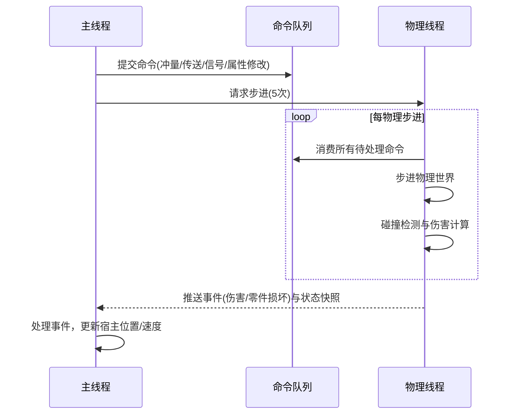
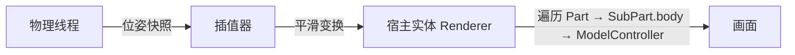
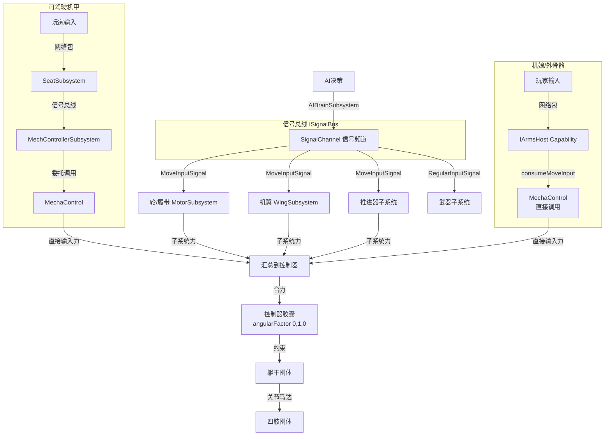
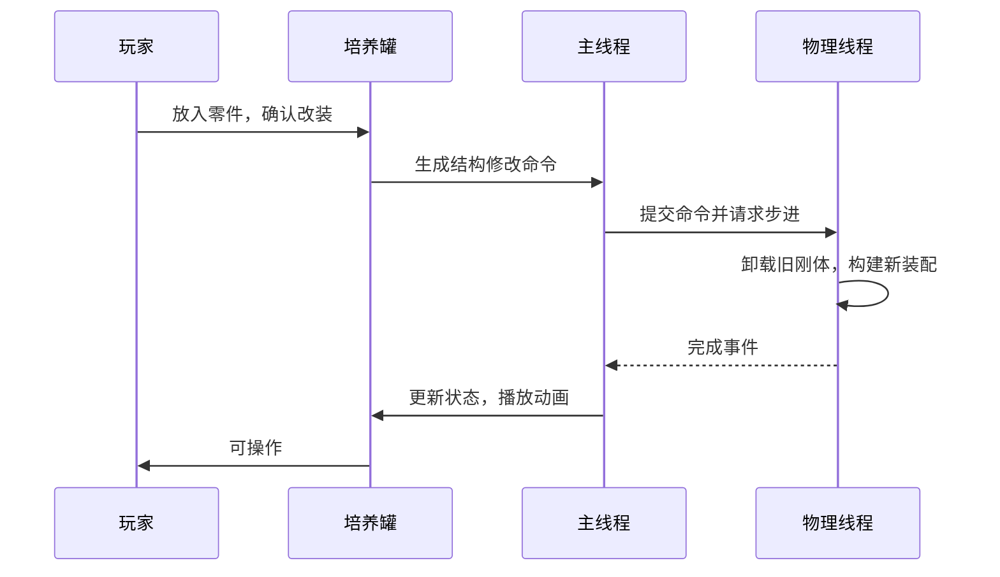

# 机娘[ARMS]模组设计文档

## 1. 设计愿景与核心思想

机娘模组旨在构建一个以物理驱动为核心的模块化机甲养成体系。玩家不再穿着固定的装备或简单地更换皮肤，而是通过培养罐在不同素体之间切换。每具素体由可替换的零件装配而成，拥有独立的物理碰撞箱、属性参数和子系统功能。模组同时支持非玩家的机娘实体（Doll）作为友方单位，具备独立的身份、成长与情感链接系统，可与玩家并肩作战。

> **术语约定**：本模组直接复用载具模组的现有术语体系（`术语表`），以下概念与载具模组保持一致：Part（零件）、SubPart（子零件）、AbstractConnector（连接点）、AbstractSubsystem（子系统）、SubsystemController（子系统控制器）、SignalChannel（信号频道）、ISignalBus（信号总线）、EnergyGrid（能量网）。新增概念将在首次出现时标注 `[新增]`。

设计围绕以下核心思想展开：

**统一实体架构**：玩家与Doll共享同一套逻辑框架。任何可成为"机娘"的宿主只需实现 `IArmsHost` 接口 `[新增]`，内部聚合一个 `ArmsCore`（逻辑机甲单元） `[新增]`。`ArmsCore` 承载基于 Part-SubPart 的物理装配、子系统网络和属性修饰管理器，与宿主的生命值、身份等属性解耦，但驱动其运动与渲染。宿主实体（Player / Doll Entity）同时作为渲染代理 `[复用宿主]`，不需要额外的 `MMPartEntity`。

**零件即功能**：继承并复用载具模组的 Part-SubPart-Connector 架构。素体的肢体、器官、外部设备均定义为 Part。Part 之间通过 Connector（AdvancedConnector/SimpleConnector）传输能量与控制信号，Subsystem 提供武器的火力、腿部的机动、电容的储能等实际功能。改装素体即是替换或增减 Part。

**异步物理驱动**：物理模拟运行于独立线程，以高于主线程的频率步进，保证复杂机械体的精确碰撞与运动。主线程通过命令队列与事件队列与物理线程交换数据，所有状态的权威修改在物理线程完成。线程模型与载具模组一致（Accumulator 模式 + ConcurrentLinkedQueue）。

**通用属性修饰**：独立的 `ModdableAttributeManager` `[新增，详见 buff系统设计文档]` 为所有数值提供三阶段加成（ADDITIVE → MULTIPLICATIVE → FINAL_MULTIPLIER）。Buff、好感度、熟练度等外部影响均以 `ModdableModifier` 形式注入，统一计算，支持按来源（source）追溯与移除。

## 2. 总体架构

### 2.1 宿主与逻辑机甲

模组定义两个核心抽象：`IArmsHost` `[新增]` 与 `ArmsCore` `[新增]`。

> **与现有接口的关系**：`IArmsHost` 是实体级别的宿主接口（玩家/Doll/AI敌人都可实现）。`ArmsCore` **不实现 `ISubsystemHost`**——子系统均挂在 SubPart 上，由 `SubsystemController` 统一管理。

`IArmsHost` 代表能够承载机娘素体的实体，负责获取输入、转发伤害、同步位置。其伪代码描述如下：

```java
interface IArmsHost {
    // 获取当前世界位置（由物理线程回写）
    Vec3 getPosition();
    void setPosition(Vec3 pos);

    // 速度，用于与物理同步
    Vec3 getVelocity();
    void setVelocity(Vec3 vel);

    // 获取宿主对应的LivingEntity（玩家或Doll），同时作为渲染代理
    LivingEntity getHostEntity();

    // 承受最终计算后的伤害
    void applyDamage(float amount, DamageSource source);

    // 获取宿主的原版属性修改器管理接口（用于修改原版Attribute，如移动速度）
    AttributeModifierManager getAttributeModifierManager();

    // 控制输入（由 Capability 收集客户端输入，每 tick 供 ArmsCore 消费）
    MoveInputSignal consumeMoveInput();       // [新增] 读取并清空移动输入
    RegularInputSignal consumeRegularInput(); // [新增] 读取并清空常规输入（开火/跳跃/切换等）

    // 序列化内部的ArmsCore
    CompoundTag save();
    void load(CompoundTag tag);

}
```

玩家侧通过能力系统（Capability）实现此接口，Doll实体则在其类定义中直接实现。

`ArmsCore` 是逻辑机甲的具体实例，不注册为世界中的独立实体。它内部拥有基于 Part-SubPart-Connector 图结构的物理装配、`SubsystemController`（复用）、`ModdableAttributeManager`（新增）以及核心运动控制器 `MechaControl` `[新增]`。其核心组成示意如下：

```java
class ArmsCore {
    // Part-SubPart 物理装配 — 复用 VehicleCore.partNet (MutableNetwork) 的图拓扑结构
    MutableNetwork<Part, Pair<AbstractConnector, SimpleConnector>> partNet;

    SubsystemController subsystemController;    // 子系统管理与信号总线 [复用]
    ModdableAttributeManager attributeManager;  // 通用属性修饰管理器 [新增]
    IArmsHost host;                             // 宿主的引用

    // -- 角色运动控制器（非子系统，ArmsCore 私有组件）-- 见 2.4 节 --
    MechaControl control;                       // [新增] 核心运动控制器，封装胶囊刚体、约束、关节马达
    MechChassisDefinition chassis;              // [新增] 素体定义元数据

    void onHostTick();                          // 主线程每tick调用
    void onPhysicsStep();                       // 物理步进中调用
    void applyDamage(float amount, DamageSource source);      // 转发伤害给宿主
}
```

> **与 VehicleCore 的区别**：`ArmsCore` ≠ `VehicleCore`。`ArmsCore` 的 Part 装配复用图结构，但不需要载具的 HP/耐久管理和 ObjectManager 维度注册。伤害从 Part → `ArmsCore.applyDamage()` → `IArmsHost.applyDamage()` 转发给宿主实体。`ArmsCore` 绑定到宿主实体的生命周期，由宿主 NBT + Capability 序列化。

### 2.2 物理线程与主线程协作

沿用载具模组既有的线程模型：服务端物理以固定频率（如100Hz）异步步进，主线程每tick向物理线程请求批量步进，并同步结果。协作机制如下mermaid图所示：



所有对物理状态的修改，包括属性修饰符的增减，都必须通过命令队列转入物理线程，确保物理步进期间无并发读写。

### 2.3 渲染

零件的视觉呈现不依赖独立的 `MMPartEntity` 代理——宿主实体本身就是渲染代理。在宿主实体的 Renderer 中，遍历 `ArmsCore` 的所有 Part，从 `SubPart.body` 读取当前物理位姿，应用内插后直接提交模型绘制（通过 Spark-Core 的 `ModelController` / `AnimController`）。`SubPart` 已有的模型与动画能力全部复用。

第一人称视角下，摄像机位置与玩家的根 SubPart 刚体同步（与载具模组的乘客摄像机逻辑一致）。渲染数据流如下图：



> **与载具的区别**：载具使用 `MMPartEntity` 作为每个 SubPart 的独立渲染代理，机娘复用宿主实体（Player / Doll Entity）的 Renderer，射线检测等交互走宿主的 `interactAt()` 方法。

### 2.4 角色运动系统

> **详见**：[角色控制器-行走物理设计](./角色控制器-行走物理设计.md) — 世界锚点隔离、状态机、功率-力-速曲线驱动模型、跳跃蓄力、抓地力模型等运动子系统的完整物理设计。

机娘的移动核心是 `MechaControl` `[新增]`，一个**非子系统的纯逻辑组件**。所有运动控制（控制器刚体、约束、关节马达）均内聚于其中，由 `ArmsCore` 私有持有。

#### 2.4.1 MechaControl — 控制器核心

```java
/**
 * 机甲运动控制器核心组件。非子系统，纯逻辑。
 * 由 ArmsCore（机娘/外骨骼）或 MechControllerSubsystem（可驾驶机甲）持有。
 * 不依赖信号总线——输入直接传入，力矩直接施加到物理刚体。
 */
class MechaControl {
    PhysicsRigidBody controllerBody;                // 胶囊刚体，angularFactor(0,1,0) 永远直立
    Generic6DofConstraint torsoConstraint;          // 躯干→控制器约束，刚度随速度自适应
    Map<String, BulletJoint> limbJoints;             // 四肢关节，马达驱动（setMotorTarget）
    Map<MotorSubsystem, String> wheelDrivers;        // 轮子驱动（有接地则收力）
    Map<WingSubsystem, String> wings;                // 机翼（有速度则收力）
    Map<ThrusterSubsystem, String> thrusters;         // 推进器

    MechChassisDefinition chassis;                   // 从 mech_chassis.json 加载的参数

    // 输入处理 — 计算直接输入力 + 肢体姿态目标
    void processInput(MoveInputSignal input, float dt);
    void processRegularInput(RegularInputSignal input);
    // 子系统合力叠加 — 轮子/机翼/推进器贡献
    void addSubsystemForce(Vec3 force);
    // 物理步进 — 施加合力 + 关节马达 + 约束更新
    void step(float dt);
}
```

#### 2.4.2 双层架构

```
┌──────────────────────────────────────┐
│  MechaControl.controllerBody（胶囊）  │
│  • angularFactor(0, 1, 0) — 永远直立 │
│  • 与地形碰撞 ✓，与投射物碰撞 ✓       │
│  ┌────────────────────────────────┐  │
│  │  torsoConstraint (6Dof)        │  │
│  │  ┌──────────────────────────┐  │  │
│  │  │  躯干 + 四肢刚体          │  │  │
│  │  │  • 不与地形碰撞            │  │  │
│  │  │  • 与投射物碰撞 ✓ (命中)   │  │  │
│  │  │  • 关节马达驱动姿态/动画   │  │  │
│  │  └──────────────────────────┘  │  │
│  └────────────────────────────────┘  │
└──────────────────────────────────────┘
```

**设计原理**：将"在世界中移动"与"姿态表现"解耦。控制器胶囊永远直立，承担所有地形交互；内部刚体负责视觉姿态、命中判定和动画表现。

#### 2.4.3 约束与关节马达

约束刚度和关节马达上限随速度连续变化，无显式模式切换：

| 速度区间 | 约束刚度 | maxMotorForce | 效果 |
|---------|---------|--------------|------|
| 步行/慢跑 | 极高（零偏移） | ≈50×体重 | 精确跟随行走关键帧 |
| 滑行/冲刺 | 中低（±5°微倾） | ≈5×体重 | 气动/碰撞力可推开肢体，自然顺应 |
| 飞行 | 低（±5°微倾） | ≈2×体重 | 气流冲击下肢体自然摆动 |

关节马达统一使用 `setMotorTarget + setMaxMotorForce`，底层以 PD 计算力矩：
```
torque = kp × (targetAngle - currentAngle) - kd × currentAngularVelocity
torque = clamp(torque, -maxMotorForce, +maxMotorForce)
```

#### 2.4.4 碰撞分层

利用 Bullet 碰撞组过滤：

```
碰撞组定义：
  GROUP_TERRAIN    = 1 << 0     GROUP_CONTROLLER = 1 << 1
  GROUP_BODY_PART  = 1 << 2     GROUP_PROJECTILE = 1 << 3

碰撞关系：
  控制器     ←碰撞→ 地形、投射物
  躯干/四肢  ←碰撞→ 投射物（命中判定）
  躯干/四肢  ←不碰撞→ 地形
```

步行时控制器为唯一地面接触点，四肢动画纯视觉表现。滑行/高速时轮子/履带 SubPart 与地形碰撞提供摩擦驱动，控制器 Y 轴约束下限放开为负值以悬浮兜底。

#### 2.4.5 输入路径（两条产品线，一个核心）

`MechaControl` 是共用引擎，仅输入来源不同：

**机娘/外骨骼（ArmsCore）**：
```
玩家按键 → 客户端网络包 → IArmsHost Capability
    → host.consumeMoveInput()
    → MechaControl.processInput()  （直接调用，不走信号总线）
    → 计算控制器力 + 关节目标 + 约束更新
    → 施加到物理世界
```

**可驾驶机甲（MechControllerSubsystem `[新增]`）**：
```
玩家按键 → 客户端网络包 → SeatSubsystem
    → 信号总线 broadcast("control_inputs", signal)
    → MechControllerSubsystem.updateMoveInputs()   ← 从信号频道读取
    → 委托给 MechaControl.processInput()           ← 同一个引擎
    → 子系统合力（轮子/机翼/推进器）叠加
    → 施加到物理世界
```

`MechControllerSubsystem` 继承 `BasicSubsystem`，在 Part JSON 中可选挂载。结构上与 `CarControllerSubsystem` 一致（`handShake` 自动发现下属轮子/机翼/推进器），输入从 `SeatSubsystem` → 信号总线获取。多个控制器实例时可利用 `SeatSubsystem` 的 `ControlGroupSet` 按优先级筛选活动控制器。

#### 2.4.6 受击与死亡

| 事件 | 行为 |
|------|------|
| 重击命中 | 短暂解锁控制器 Z 轴（0.3~0.5s）→ 侧倾 → PD 回正 → 重新锁定 |
| 死亡/晕眩 | 完全解锁 angularFactor → 自然倒地 → 躯干约束解除 → ragdoll |
| 腿部全毁 | 永久解锁 → 倒地 |

### 2.5 两条产品线 > `MechaControl` 共享核心

模组支持两种机甲形态，共用同一个 `MechaControl` 引擎，仅输入来源和生命周期管理方式不同。

#### 2.5.1 机娘/外骨骼（ArmsCore）

玩家直接作为宿主实体。`IArmsHost` Capability 收集输入，`ArmsCore` 私有持有 `MechaControl`，直接调用 `processInput()`。

```
ArmsCore
├── control: MechaControl          ← 私有字段，非子系统，UGC 不可见
├── chassis: MechChassisDefinition ← 从 mech_chassis.json 加载
├── partNet                        ← 图装配
├── subsystemController            ← Part 上的子系统（武器/能源/推进器等）
└── host: IArmsHost                ← 控制输入、伤害转发、位置同步
```

- 输入路径：`IArmsHost.consumeMoveInput()` → `MechaControl.processInput()`（直接调用，不走信号总线）
- 伤害路径：Part → `ArmsCore.applyDamage()` → `IArmsHost.applyMechDamage()`
- 渲染：宿主实体 Renderer 遍历 Part → SubPart 模型
- **可被其他 SeatSubsystem 搭载**：外骨骼驾驶员坐进高达座舱（`IArmsHost` 不会被 `SeatSubsystem` 拒绝）

#### 2.5.2 可驾驶机甲（VehicleCore 扩展 + MechControllerSubsystem）

传统的"坐进去"型机甲，属于载具范畴。`MechControllerSubsystem` 作为 `BasicSubsystem` 挂在躯干 Part 上，兼容现有 Part JSON 和 `SeatSubsystem`。

```
VehicleCore（或扩展子类）
├── partNet
├── SeatSubsystem                  ← 座椅子系统（乘客 riding）
├── MechControllerSubsystem        ← 子系统，持有 MechaControl 引用
│   └── control: MechaControl      ← 同一个引擎
└── HP / ObjectManager 注册
```

- 输入路径：`SeatSubsystem` → 信号总线 → `MechControllerSubsystem.updateMoveInputs()` → `MechaControl.processInput()`
- `MechControllerSubsystem` 继承 `BasicSubsystem`，结构上与 `CarControllerSubsystem` 一致
- `handShake()` 自动发现下属轮子/机翼/推进器
- 渲染走 `MMPartEntity`
- **不能被其他 SeatSubsystem 搭载**（已有的 SeatSubsystem 互斥机制保证）

#### 2.5.3 对比

| | 机娘/外骨骼 (ArmsCore) | 可驾驶机甲 (VehicleCore 扩展) |
|---|---|---|
| MechaControl 归属 | ArmsCore 私有字段 | MechControllerSubsystem 持有 |
| 输入来源 | IArmsHost Capability | SeatSubsystem → 信号总线 |
| 是否实现 ISubsystemHost | 否 | VehicleCore 已有 |
| 伤害目标 | 转发给宿主 HP | VehicleCore 自有 HP |
| 死亡行为 | 宿主死亡 → 残骸 | VehicleCore 解体 |
| 渲染 | 宿主 Renderer | MMPartEntity |
| 可被载具搭载 | ✓ (外骨骼坐高达) | ✗ (SeatSubsystem 互斥) |
| UGC 可见性 | 不可见（MechaControl 非子系统） | 可见（Part JSON 子系统） |

## 3. 素体与改装

### 3.1 素体结构

素体由核心框架零件和若干附属零件构成。核心框架定义了机体的基础碰撞箱轮廓与主要连接点。肢体、器官、外部设备均以零件形式通过连接点装配。零件的刚体共同组成机甲的完整物理碰撞模型。

### 3.2 控制信号与信号总线

模组有两条并行的控制输入路径，最终汇聚到同一个 `MechaControl` 引擎：



> **与载具模组的信号流一致**：玩家输入 → `SeatSubsystem.setMoveInputSignal()` → `sendSignalToAllTargets("control_inputs", signal)` → 目标子系统从 `signalInputChannels` 读取。**区别**：机娘额外有一条 IArmsHost → MechaControl 的直接调用路径，不走信号总线，确保控制入口唯一且不被 UGC 复制。

### 3.3 子系统与能量网络

零件可提供子系统以实现具体功能。能量通过连接点沿装配网络传输，复用载具模组已实现的电力系统，机娘素体内的能量生成、储存与消耗均在该网络内完成。

### 3.4 改装流程

玩家通过培养罐交互界面进行零件替换。界面提交改装方案后，主线程生成结构修改命令并发送至物理线程。物理线程在步进开始前重建刚体装配，完成后回传确认。流程如下图所示：



### 3.5 素体定义 JSON

素体元数据独立于 PartType，存储为 `mech_chassis.json`。由新内容包模块 `MechDefinitionModule` 加载，与 `PartModule`/`AssemblyModule` 同级。


| 字段 | 作用 | 仅用于 |
|------|------|--------|
| `id` / `name` | 素体唯一标识和显示名 | 机娘/外骨骼 |
| `root` | 指定根 Part 和 SubPart（躯干锚点） | 两者 |
| `controller` | 控制器胶囊尺寸、质量、基础移动速度、越障参数 | 两者 |
| `motor_force` | 关节马达力曲线（×体重系数） | 两者 |
| `preset_assembly` | 默认装配方案：连接点 → 零件映射 | 推荐，也可二次改装 |
| `limb_mapping` | 连接点 → 关节功能映射（如左腿关节 = 左髋连接点） | 两者 |
| `animation_set` | 默认关键帧动画集 ID | 两者 |

> **与 PartType JSON 的职责边界**：PartType 定义单个零件的物理属性、子系统和连接器。`mech_chassis.json` 定义一具完整素体的装配方案和运动参数，不包含子系统定义——子系统由装配的各个 Part 自带。

## 4. 甲弹对抗与部位破坏

### 4.1 精确命中与伤害计算

投射物和近战攻击的命中判定利用物理引擎的精确碰撞检测。当攻击的包围盒与机甲刚体发生碰撞时，系统计算入射角、等效装甲厚度等参数，执行甲弹对抗算法。仅当侵彻力足够穿透装甲时，伤害才会传递至内部零件或宿主。

### 4.2 部位破坏与功能丧失

每个 Part 拥有独立的结构完整性值（通过 `DestroyableObject` 的耐久度系统 `[复用]`）。遭受伤害时，对应 Part 的耐久度下降。当耐久度降至阈值以下，Part 进入损坏状态，其关联的 Subsystem 性能下降或完全失效。零件耐久耗尽后可从连接点物理脱落。

脱落时复用 `VehicleCore.partNet` 的图分裂逻辑 `[复用]`：从图中移除损坏 Part，对剩余连通分量进行检测：
- **单零件孤岛** → 生成残骸实体（`WreckageEntity` `[新增]`），保留刚体但移除子系统功能
- **多零件分量** → 若为敌方机甲则保持独立残骸装配体；若为友方则视为待修复状态

零件可能被标记为弱点。击中弱点会导致额外效果，如引发能量核心的连锁爆炸。

### 4.3 伤害传递与宿主生命

甲弹对抗最终计算出侵彻伤害值。该值一方面扣减零件耐久度，另一方面经过换算后作用于宿主实体。调用`IArmsHost.applyMechDamage()`，其实现中应触发原版受伤逻辑。例如，玩家宿主的实现可能如下：

```java
@Override
public void applyMechDamage(float amount, DamageSource source) {
    Player player = (Player) this;
    player.hurt(source, amount); // 触发原版无敌帧、击退等
}
```

## 5. Doll实体与养成系统

### 5.1 心智核心与身份唯一性

每个Doll拥有唯一的心智核心，这是一个带UUID的特殊物品，存储名称、好感度、熟练度、记忆及死亡计数等数据。Doll死亡后残骸中掉落心智核心，玩家回收后可置入新素体实现复活。

### 5.2 好感度与熟练度

好感度通过与玩家共同战斗、定期维护等行为提升，被误伤或长期闲置则下降。熟练度针对特定武器或机动类型随使用频次增长。二者均以 `ModdableModifier`（属性修饰符 `[新增]`）的形式影响机甲性能。以下伪代码展示好感度更新与修饰符注入：

```java
void onAssistKill(Player player) {
    affinity += 2.0;
    if (affinity > 80) {
        attributeManager.addModifier("mech:energy_regen",
            new ModdableModifier(
                UUID.fromString("affinity-regen-uuid"),  // uuid，用于精确移除
                "affinity",                               // source，来源标签
                Stage.MULTIPLICATIVE,                      // stage，百分比加算阶段
                0.1                                        // value，10% 加成
            ));
    }
}
```

> **与 Buff 系统设计文档一致**：`ModdableModifier` 使用三阶段公式（ADDITIVE → MULTIPLICATIVE → FINAL_MULTIPLIER），`Stage` 枚举定义见 `buff系统设计文档`。

### 5.3 属性修饰与子系统交互

Doll及玩家的机甲均使用统一的属性修饰系统。好感度、熟练度以及各类Buff向`ArmsCore`的属性管理器添加修饰符，按阶段参与数值计算。Doll的子系统在运行时查询这些属性值，从而让养成结果实际作用于战斗表现。

## 6. 敌人设计

### 6.1 预装配机甲敌人

敌对单位同样实现`IArmsHost`接口，内部聚合由蓝图预定义的`ArmsCore`。它们使用完全相同的零件、物理和子系统机制，因此也遵循部位破坏规则。

### 6.2 部位破坏与战术深度

摧毁腿部零件可限制其移动，摧毁武器挂架可解除火力威胁。玩家需根据敌机构成制定打击顺序，而非单纯消耗血量。

### 6.3 残骸回收与资源循环

敌人死亡后，残骸中包含可回收的零件。玩家可从中拆解出有价值部件，用于改装或维修，形成战斗与资源循环。

## 7. 死亡、重生与状态切换

### 7.1 玩家死亡处理

机娘状态下的玩家死亡时，其`ArmsCore`依据游戏规则可能保留、掉落为残骸或彻底损毁。默认规则下，机甲残骸保留于死亡地点，玩家重生为人类形态，需返回残骸处回收零件或维修。

### 7.2 Doll死亡处理

Doll死亡时，`ArmsCore`解体并生成残骸，心智核心掉落在残骸中。心智核心保留所有养成数据，复活后延续身份与情感积累。

### 7.3 素体切换

培养罐作为切换素体的工作站。切换时，当前`ArmsCore`序列化保存，新素体蓝图加载并实例化。宿主属性修饰器被清空并重新应用新素体的基础修饰符。该过程中玩家被暂时固定，伴随罐体开关动画。

## 8. 物品栏与储存隔离

机甲素体拥有独立的装载空间，由零件自带的储物子系统提供。这些装载空间与宿主的原版背包隔离。切换素体时，旧素体的装载内容随素体移除，新素体加载其自身库存。驾驶员保留原版背包，用于携带工具和个人物品，增强代入感和差异化。

## 9. 模组兼容性策略

为保证与其他模组的良好兼容，设计遵循以下原则：宿主实体保持原版类型，通过接口和能力系统扩展功能，而非替换实体类。外部模组对宿主实体的属性操作通过原版Attribute系统正常叠加，机甲的专用数值在独立属性修饰系统内运行。

外部传送、击退等物理交互通过命令队列转换为对物理刚体的操作。属性修改装备直接作用于原版Attribute实例，与机甲系统互不影响。储物空间通过标准能力接口暴露，允许自动化模组与之交互。调整玩家属性的具体路径如下：

当机甲系统需要修改玩家原版属性（如移动速度、最大生命）时，通过`IArmsHost.getAttributeModifierManager()`获取原版属性修改器管理器，动态添加或移除`AttributeModifier`。例如，腿部零件提高移动速度的实现：

```java
void applyLegMobilityBoost(IArmsHost host, double boostAmount) {
    AttributeModifier mod = new AttributeModifier(
        UUID.fromString("..."), "mech_leg_speed",
        boostAmount, AttributeModifier.Operation.MULTIPLY_TOTAL);
    host.getAttributeModifierManager().addTransientModifier(
        Attributes.MOVEMENT_SPEED, mod);
}
```

当零件损坏或切换素体时，通过UUID精确移除对应修改器，确保属性不残留。

## 10. 总结

机娘模组在统一的物理与零件框架之上，构建了从玩家到AI、从素体改装到养成、从部位破坏到资源循环的完整玩法闭环。通过逻辑机甲与宿主的分离、异步物理的线程安全协作以及通用属性修饰系统，模组在保证技术深度的同时维持了较强的扩展能力和模组兼容性。核心接口与数据流的伪代码及图表为后续的分阶段实现提供了精确的蓝图。

---

## 附录A：术语对照表

| 机娘概念 | 载具模组现有术语（复用） | 类型 |
|---------|------------------------|------|
| Part（零件） | `Part` / `PartType` / `VariantAttr` | 复用 |
| SubPart（子零件/肢体） | `SubPart` / `DestroyableRigidObject` | 复用 |
| Connector（连接点） | `AbstractConnector` / `AdvancedConnector` / `SimpleConnector` | 复用 |
| Subsystem（子系统） | `AbstractSubsystem` / `AbstractControllableSubsystem` | 复用 |
| SeatSubsystem（座椅子系统） | `SeatSubsystem` | 复用 |
| 信号总线 | `ISignalBus`（由 `SubsystemController` 实现） | 复用 |
| 信号频道 | `SignalChannel` | 复用 |
| 信号 | `MoveInputSignal` / `RegularInputSignal` / `ViewInputSignal` 等 | 复用 |
| 电力能量网 | `EnergyGrid` / `IEnergyProducer` / `IEnergyConsumer` | 复用 |
| 伤害计算 | `BFDamageApi` (BallisticsFramework) | 复用 |
| 耐久度/破坏 | `DestroyableObject` / `DestroyableRigidObject` | 复用 |
| 图拓扑/装配 | `VehicleCore.partNet` (`MutableNetwork`) | 复用（简化） |
| 图分裂 | `VehicleCore` 分裂构造函数 | 复用（扩展） |
| 属性修饰管理器 | `ModdableAttributeManager` | 新增（载具也可用） |
| 属性修饰符 | `ModdableModifier` + `Stage` 枚举 | 新增（载具也可用） |
| 宿主接口 | `IArmsHost` | 新增 |
| 逻辑机甲单元 | `ArmsCore` | 新增 |
| 核心运动控制器 | `MechaControl`（非子系统，纯逻辑组件） | 新增 |
| 机甲控制子系统 | `MechControllerSubsystem`（可驾驶机甲用，继承 BasicSubsystem） | 新增子系统类型 |
| 素体定义 | `MechChassisDefinition` / `mech_chassis.json` | 新增内容包模块 |
| 小脑子系统（AI） | `AIBrainSubsystem` | 新增子系统类型 |
| 残骸实体 | `WreckageEntity` | 新增实体类型 |
| 培养罐 | `GrowthTankBlock` / `GrowthTankBlockEntity` | 新增方块 |
| 心智核心 | `MindCoreItem` | 新增物品 |
| 好感度/熟练度 | `ModdableModifier`（通过属性系统注入） | 新增数值 |
| 渲染代理 | 宿主实体（Player / Doll Entity） | 复用宿主 |
| 控制器刚体 | `PhysicsRigidBody` + `setAngularFactor(0,1,0)` | 新增 |
| 躯干约束 | `Generic6DofConstraint`（Bullet六自由度约束） | 新增 |
| 关节马达 | Bullet `setMotorTarget()` / `setMaxMotorForce()` | 新增 |
| 碰撞组过滤 | Bullet collision group | 新增 |

## 附录B：与载具模组的关键差异

| 维度 | 载具模组 | 机娘模组 |
|------|---------|---------|
| 顶层管理器 | `VehicleCore` | `ArmsCore`（轻量，不注册到 ObjectManager） |
| 维度管理 | `ObjectManager` 按 Level 索引 | 绑定宿主实体生命周期 |
| 渲染 | 每个 SubPart 有 `MMPartEntity` 代理 | 宿主实体即为代理，在其 Renderer 中遍历 |
| 交互 | 通过 `MMPartEntity.interactAt()` | 通过宿主实体的 `interactAt()` + 射线检测 |
| 装配拓扑 | `partNet` (MutableNetwork) 完整图 | 复用图结构，但无载具的合并/分裂全部流程 |
| 分裂产物 | 新 `VehicleCore` | 新 `VehicleCore`（多零件分量）或 `WreckageEntity`（单零件） |
| 属性系统 | 无（各处硬编码 / `DamageModifier`） | `ModdableAttributeManager`（Buff/养成/装备统一注入） |
| HP 系统 | `VehicleCore` 级 maxHp + hp | 宿主实体原版生命值 + `IArmsHost.applyMechDamage()` |
| 创建/修改 | 零件物品放置、撬棍/焊枪 | 培养罐界面 |
| 角色控制器 | 无（各 SubPart 刚体直接承重/碰撞地形） | 双层架构：控制器胶囊 + 内部刚体，仅控制器与地形碰撞 |
| 控制入口 | 信号 → MotorSubsystem → 刚体力 | **两条路径**：IArmsHost → MechaControl 直接调用（机娘）或 SeatSubsystem → 信号总线 → MechControllerSubsystem → MechaControl（可驾驶机甲） |
| 姿态/动画 | 各 SubPart 独立运动 | 关键帧驱动关节马达，maxMotorForce 随速度自适应 |
| AI 控制 | 无 | 小脑子系统 + AI 决策 |
| 素体元数据 | 无（PartType + AssemblyModule） | 独立 `mech_chassis.json`（MechDefinitionModule 加载） |