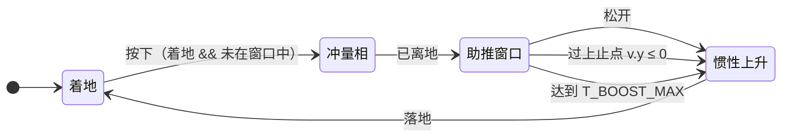

# 跳跃模型改造：瞬时冲量 + 持续助推

**实施状态：已实施（`.\gradlew test` 全绿）。**

本文描述跳跃的模型。正文（§1–§8）按实施后成立的陈述给出；§2 的代码改动清单、§4 的测试与 §5 的文档同步清单记录本次改造。

参数归属：`src/main/java/io/github/sweetzonzi/arms_core/common/control/attr/MechaJumpAttr.java`。

---

## 1. 模型

### 1.1 三个阶段

| 输入 | 行为 |
| --- | --- |
| 按下跳跃键（着地且未在窗口中） | 冲量相：立即按 `I_BASE` 施放冲量并离地，**无前置延迟** |
| 保持按住 | 助推窗口：持续施加向上助推 `F_BOOST` |
| 松开 | 立即终止窗口，重力接管 |



助推窗口终止后不因继续按住而重开；重新进入窗口要求再次着地（见 §8 的落地行为）。

### 1.2 参数

| 参数 | 值 | 单位 | 作用 |
| --- | --- | --- | --- |
| `I_BASE` | 325 | N·s | 冲量相的动量输入 |
| `F_BOOST` | 500 | N | 助推窗口内的持续助推 |
| `T_BOOST_MAX` | 0.20 | s | 助推窗口的硬时长上限（服务端 20 步 @100 Hz；客户端约 12 步 @60 Hz） |
| `V_EXTEND` | 10 | m/s | **冲量相**的起跳速度上限 |
| `GRAVITY` | 9.81 | m/s² | `MechaWalkingAttr#GRAVITY` |
| `m` | `MechaCharacter#getControllerMass` | kg | 可变；素体默认 `MechaWalkingAttr#MASS` = 70 |

```
冲量相：v0 = min(I_BASE / m, V_EXTEND)
助推窗口：a = F_BOOST / m ，垂直净加速度 = F_BOOST / m − g
```

`V_EXTEND` 建模肌肉收缩速度 / 电机速度上限，**只钳制冲量相的起跳速度**，不参与助推窗口内的速度钳制——窗口的能量上限由 `F_BOOST` 与 `T_BOOST_MAX` 共同给出。实现上该上限经覆写口 `MechaCharacter#getJumpSpeedCap` 取得（素体默认返回 `V_EXTEND`，多腿子系统覆写为 `max(各腿 v_extend)`），因此上文两式的 `V_EXTEND` 指素体默认值。

物理步长两端不同：服务端 1/100 s（100 Hz）、客户端约 1/60 s（60 Hz），由 `ArmsCore#physicsStepSeconds` 从 `PhysicsLevel#getTps()` 取得。助推窗口按物理步衰减，`T_BOOST_MAX` = 0.20 s 在两端分别表现为 20 步与约 12 步。按键与释放事件由主线程 tick（20 Hz）采样，释放粒度见 §1.3。

### 1.3 三条终止条件

窗口在下列任一条件先满足时终止：

| 条件 | 判据 | 不可替代的作用 |
| --- | --- | --- |
| 松开 | held 变假，或 `MechaEvent#JUMP_RELEASE` 边沿被消费 | 玩家控制 |
| 过上止点 | `v.y ≤ 0` | `F_BOOST/m < g` 时，过顶点后向上助推转为减速下落，视觉等同悬浮；不截断会表现为「越按住越飘」 |
| 达到最大时长 | 累计助推时长达到 `T_BOOST_MAX`（`jumpBoostRemainingS` 衰减到 0） | `F_BOOST/m ≥ g` 时（轻机体）窗口内不出现上止点，此时只有时间能收住 |

三条各自覆盖不同的质量区间，缺一不可：上止点覆盖 `F_BOOST/m < g`，最大时长覆盖 `F_BOOST/m ≥ g`，松开覆盖玩家控制。

**释放粒度**：`held` 与 `MechaEvent#JUMP_RELEASE` 由主线程 tick（20 Hz）采样，窗口按物理步（服务端 100 Hz）衰减，因此「松开」最迟在下一个主 tick 被观察到，窗口最多多推 1 个主 tick（0.05 s ≈ 5 个服务端物理步）。上止点与最大时长按物理步判定，不受该粒度影响。

### 1.4 不悬浮的构造性保证

`T_BOOST_MAX` 与质量无关，因此对任意 `m` 都成立：窗口最多持续 `T_BOOST_MAX`，之后仅剩重力。即使 `F_BOOST/m ≥ g` 也不存在持续悬浮。

模型因此不依赖「`F_BOOST < m·g`」这类质量相关约束——这类约束在 `m` 可变时会失效（助推与重量之比随质量漂移，轻机体可能超过 1 而形成真悬浮）。

### 1.5 与质量的关系

冲量相与助推窗口的加速度都按 `1/m` 缩放，高度对质量因此是 `1/m²`。`F_BOOST` = 500 N、`T_BOOST_MAX` = 0.20 s 时：

| `m` (kg) | `F_BOOST/m − g` (m/s²) | 按住至截止的高度 | 窗口末速 (m/s) |
| --- | --- | --- | --- |
| 35 | +4.48 | 7.23 m | 10.18 |
| 70 | −2.67 | 1.74 m | 4.11 |
| 140 | −6.24 | 0.40 m | 1.07 |

「轻机体跳得明显更高」是物理正确的陡峭，接受。`m = 35` 时窗口末速超过 `V_EXTEND`，同样是接受的后果——`V_EXTEND` 只约束冲量相。

### 1.6 参考高度（`m` = 70 kg）

轻拍（不进入窗口）：

```
v0 = 325 / 70 = 4.643 m/s
h  = v0² / (2g)  = 1.10 m
上升时长 = v0 / g = 0.473 s
```

按住至截止：

| `F_BOOST` (N) | `T_BOOST_MAX` (s) | 高度 (m) | 上升总时长 (s) | `F_BOOST · T_BOOST_MAX` (N·s) |
| --- | --- | --- | --- | --- |
| 400 | 0.25 | 1.70 | 0.62 | 100 |
| 420 | 0.25 | 1.74 | 0.63 | 105 |
| 450 | 0.25 | 1.79 | 0.64 | 113 |
| 420 | 0.30 | 1.85 | 0.66 | 126 |
| **500** | **0.20** | **1.74** | **0.62** | **100** |
| 600 | 0.15 | 1.70 | 0.60 | 90 |

选值：`F_BOOST` = 500 N、`T_BOOST_MAX` = 0.20 s。读表要点：

1. 高度主要由 `F_BOOST · T_BOOST_MAX`（有效附加冲量）决定，取 100–125 N·s 起步，与 `I_BASE` 之比约 1 : 3。
2. 同高度下，`F_BOOST` 越大 / `T_BOOST_MAX` 越短，手感越干脆；反之越飘。
3. `T_BOOST_MAX` 取物理步长的整数倍——服务端 1/100 s、客户端约 1/60 s——避免最后一帧被截在半个步长上导致双端微不一致。上表的 0.15 / 0.20 / 0.25 / 0.30 在两端都是整数步。

---

## 2. 代码改动清单

### 2.1 `MechaJumpAttr`

| 动作 | 内容 |
| --- | --- |
| 删除 | `I_MAX`、`T_CHARGE`、`CHARGE_WALK_PENALTY` |
| 更名 | `I_MIN` → `I_BASE`（值 325 不变） |
| 新增 | `F_BOOST` = 500.0f（N）、`T_BOOST_MAX` = 0.20f（s） |
| 保留 | `V_EXTEND` = 10.0f，注释说明其为「冲量相的起跳速度上限」 |
| 更新 | 类 Javadoc：删除蓄力表述，补「瞬时冲量 + 助推窗口」与多腿叠加的定制点说明 |

### 2.2 `MechaCharacter`

| 位置 | 改动 |
| --- | --- |
| 状态字段 | `chargingJump` / `chargeTimer` → `jumpBoostRemainingS`（助推窗口剩余时长）；`isChargingJump()` → `isBoosting()`（即 `jumpBoostRemainingS > 0`） |
| `MechaCharacter#updateJump` | 重写（见下） |
| `MechaCharacter#updateWalk` | 垂直分量必须**叠加**助推增量，见「垂直注入」 |
| `MechaCharacter#controlForceScale` | 删除蓄力折减项，恢复 `v_W = V_REF × f(σ)` |
| `MechaCharacter#warp` 路径 | 归零 `jumpBoostRemainingS`（与「立即终止」同一动作） |
| `MechaCharacter#computeJumpImpulse` | 去掉 `ratio` 形参 → `computeJumpImpulse()`；注释去蓄力比，并说明冲量不由 `inputScale` 调制（见「权限」） |
| `MechaCharacter#getJumpSpeedCap` | 保留并继续承载冲量相上限：起跳取 `min(computeJumpImpulse() / m, getJumpSpeedCap())`，多腿子系统仍可覆写为 `max(各腿 v_extend)`。不把上限硬写为 `V_EXTEND` |
| 新增 `MechaCharacter#getBoostForce` | `protected`，默认返回 `F_BOOST`；腿部子系统覆写为多腿叠加，测试覆写为 0 |
| 新增 `MechaCharacter#cancelBoost` | 置 `jumpBoostRemainingS = 0`；供受击 / 硬直 / 入水等中断源调用（本轮不接线） |
| `inputScale` 字段 Javadoc | 删去「同时作用于跳跃冲量」的表述，只保留对 WASD 连续量的作用 |
| 权限变更 | `updateJump` 去掉 `inputScale > EPSILON` 的起跳门控与冲量的 `× inputScale`：`set_input_scale(0)` 因此不再能锁住跳跃。这是与 `bypassObservation` 相关的有意变更，见「权限」 |
| 类 Javadoc | 定制点列表中冲量与助推两处注释更新 |

**`updateJump` 重写后的状态迁移**

```
每物理步（dt = 双端各自的物理步长）：
  if jumpBoostRemainingS <= 0 && 着地 && held:   // 冲量相进入
      v0 = min(computeJumpImpulse() / m, getJumpSpeedCap())
      setJumpSpeed(v0); jump()
      jumpBoostRemainingS = T_BOOST_MAX

  if jumpBoostRemainingS > 0:                    // 助推窗口内
      if released || !held || vel.y <= 0:     // 松开 / 上止点：立即归零
          jumpBoostRemainingS = 0
          boostDvY = 0
      else:
          boostDvY = (F_BOOST / m) * dt     // 本步注入 updateWalk
          setJumpSpeed(vel.y + boostDvY)     // 同步抬高 KCC 的上升速度上限，见下
          jumpBoostRemainingS -= dt              // 衰减；到 0 后窗口自然结束
  else:
      boostDvY = 0
```

冲量相那一物理步同时进入窗口（`jumpBoostRemainingS` 赋 `T_BOOST_MAX` 后立即参与本步施力并衰减），因此有效助推时长恰为 `T_BOOST_MAX`（服务端 20 步、客户端约 12 步）。「先判终止、后施力、再衰减」的顺序保证松开的那一物理步不注入助推。

**KCC 的上升速度上限必须同步抬高。** `btKinematicCharacterController#playerStep` 在扣掉重力后把 `m_verticalVelocity > m_jumpSpeed` 的部分截回 `m_jumpSpeed`，而 `m_jumpSpeed` 正是本模块 `setJumpSpeed` 写入的起跳速度。助推窗口期间若不逐步抬高它，助推增量会被引擎静默钳回冲量起跳速度——`F_BOOST/m ≥ g` 的轻机体（`m` = 35）会完全失效、窗口末速停在 `v0` 而非设计值 10.18 m/s。因此注入分支同时调用 `setJumpSpeed(vel.y + boostDvY)`，让该上限跟随本步目标速度；`jump()` 每次起跳前都会用 `setJumpSpeed(v0)` 重设，不受影响。

**垂直注入（`updateWalk`）**

`updateWalk` 持有全类唯一的 `setLinearVelocity` 调用，助推的垂直注入必须经它落盘，且必须是叠加而非覆盖：`updateWalk` 中垂直分量的取值有两条支路（存在动画根 Y 位移时以动画位移换算值替代 KCC 垂直速度），两条支路都要加上 `boostDvY`：

```
yVel = verticalVel + boostDvY                       // 常规支路
yVel = (动画根 Y 位移 / dt) + boostDvY               // animDeltaY 支路
```

只改常规支路会让带动画根位移的动作（翻越、踉跄等）静默抹掉助推。

**权限**：跳跃许可由逻辑层状态机的 `CAN_JUMP` 表达，KCC 不读取 `inputScale`（它只作用于 WASD 连续量），冲量也不由 `inputScale` 调制。`bypassObservation` 默认开启时反向门控整段不生效，因此该配置下跳跃不受许可约束——本轮接受这一状态，待 `bypassObservation` 关闭后由 `CAN_JUMP` 接管。

### 2.3 `MechaControl`

| 位置 | 改动 |
| --- | --- |
| 采集 KCC 状态 | `KCC_JUMP_BOOSTING` ← `kcc.isBoosting()` |
| `MechaControl#forwardInputToKCC` 的跳跃门控 | 保持「`CAN_JUMP` 或 正在助推」的旁路 |
| `MechaControl#LogicStateSnapshot` | 删除字段 `jumpCharging`，记录缩为 `posture` / `gait` / `vertical` / `energy`。该字段唯一消费者是同步写包（见 §3.1），随 `DATA_JUMP_CHARGING` 一并删除后无其他消费方 |
| 旁路观测路径 | 不变（`snap.jumpPressed()` / `jumpRelease` 原样透传） |

**门控陷阱**：`CAN_JUMP` 只在 `Posture.STAND` 为真，离地即假。若把跳跃门控写成 `jumpPressed && CAN_JUMP`，助推窗口会在离地第一步被掐死。必须保留「正在助推」这条旁路，使窗口内的 held 继续透传。

**旁路模式下的许可**：上述门控只在反向控制分支生效。`bypassObservation` 默认开启时跳跃原样透传，不受 `CAN_JUMP` 约束（见 §2.2「权限」）。

### 2.4 状态机层

| 文件 | 改动 |
| --- | --- |
| `state/domain/Vertical.java` | 删除 `JUMP_CHARGE`；新增 `JUMP_BOOST("jump_boost")`（枚举 Javadoc 说明为「空中蹬伸助推窗口活跃」） |
| `state/MechaStateVariableKeys.java` | 删除 `IS_JUMP_CHARGING` / `KCC_JUMP_CHARGING`；新增 `IS_JUMP_BOOSTING`（表现层 one-hot）与 `KCC_JUMP_BOOSTING`（状态机权威输入） |
| `state/graph/MechaStateActions.java` | `verticalFlags` 中 `IS_JUMP_BOOSTING ← v == Vertical.JUMP_BOOST` |
| `state/preset/VerticalSubGraphs.java` | `buildStandVert` 缩为单节点 `ground` 图（保留 `enableVerticalInput()`，stand 期权限不变）；`buildAirVert` 的 `fall` 增加 `fall ⇄ jump_boost`，条件 `isTrue(KCC_JUMP_BOOSTING)` / `isFalse(KCC_JUMP_BOOSTING)`，`jump_boost` 的 onEntry 用 `enableVerticalMoveOnly()`（保留空中水平控制）；类 Javadoc 的 posture 表更新 |
| `MechaLogicStateMachine` | 不改（`hasVerticalMachine` 仍含 `STAND`） |

`jump_boost` 只存在于 air 图：起跳瞬时化后，地面不存在任何助推窗口状态。

air 子机的根节点仍是 `fall`，`jump_boost` 靠 `KCC_JUMP_BOOSTING` 迁移进入。冲量在 `stand` 施放、离地后 `posture` 才切 `air`，子机先落在 `fall`，因此 `jump_boost` 至少滞后一个主 tick 出现（量化说明见 §1.3）。

内容包影响：`src/main/resources` 中不存在 `jump_charge` / `is_jump_charging` 引用，变量名变更不破坏现有资源。

---

## 3. 网络层

### 3.1 数据集合的改动

| 信号 / 字段 | 处理 | 语义 |
| --- | --- | --- |
| 按下 / 持续 | 不变：`keyFlags` 的 `BIT_JUMP`（连续量，可丢可合并） | 窗口的持续保持 |
| 松开 | 不变：`MechaEvent#JUMP_RELEASE`（单帧边沿，`ARMSClient#collectAndSend` 产生，物理线程消费一次） | 窗口的即时终止 |
| `ArmsCore#DATA_JUMP_CHARGING` | 删除 | 承载的信息与 `DATA_VERTICAL` 完全重合（`jump_boost` 即「窗口活跃」），且无运行时消费者 |
| 新增计时器字段 | 不新增 | 理由见 §3.2 |

`MechaEvent` 顺序与协议版本均不变。`DATA_JUMP_CHARGING` 是字段表最后一个 accessor，而字段表只允许在末尾追加，删除末尾项不移动其余 accessor 的 id，双端线上格式对既有字段零影响。

删除该 accessor 牵动四处引用，须同批改：`ArmsCoreServerEvents#syncToClients` 的写入（随 `LogicStateSnapshot` 字段删除而去掉）、`ArmsCore#DEFAULT_VALUES` 的默认值项、`ArmsCoreDebugCommand` 的读取，以及 `ARMSNetworkCodecTest` 的两条断言（见 §4.1）。

### 3.2 为什么不同步剩余助推时长

客户端不创建 KCC 与状态机（`ArmsCore#newClientInstance`，`authoritative = false`），是零仿真端，其表现只能由同步数据驱动。同步集合的判据因此是：**让客户端能还原服务端的逻辑状态**，而不是暴露服务端的内部计时器。

| 维度 | 由什么还原 |
| --- | --- |
| 状态（`jump_boost` / `fall` / `glide` …） | `DATA_VERTICAL`（`Vertical.molangName()`） |
| 相位（窗口进行到几成） | 客户端按 `DATA_VERTICAL` 进入 `jump_boost` 的上升沿起本地计时，时长取共享常量 `T_BOOST_MAX` |

不同步剩余助推时长的理由（本轮即 `jumpBoostRemainingS`；闪避的对应字段见 §7）：

1. **派生量。** 计数器「驱动了什么」已由 `DATA_VERTICAL` 表达；同步它等于把实现细节塞进协议，与「同步逻辑层产出」的既有约定相悖。
2. **每 tick 脏。** 倒计时每物理步都在变，`packDirty` 会在整个窗口期间逐 tick 发包；状态枚举只在进入/退出时产生两个边沿。
3. **过期无解。** 倒计时没有时间戳，客户端在 `t + latency` 收到「还剩 0.19 s」后按现值使用必然偏晚，要正确使用需配 sync tick 做外推，而该机制目前不存在。状态枚举的延迟只造成相位平移，持续时间仍然正确。
4. **单位陷阱。** 两端物理步长不同（服务端 100 Hz、客户端约 60 Hz，`ArmsCore#physicsStepSeconds`）。按「剩余步数」同步会被客户端按自己的步长解释而整体偏错；将来若必须同步，只能以秒量化。
5. **闪避的助推窗口本轮不存在。** `dodgeRemainingS` 与闪避的助推注入同批实现（§7），当前只有跳跃一个计时器，没有第二个可同步的对象。

**触发条件**：当客户端引入预测 / 回滚，或出现明确消费倒计时的表现（推力火焰按剩余时长淡出、UI 进度条）时，再同步这个量。届时跳跃与闪避必须同批，且带 sync tick、以秒为单位。

### 3.3 已知行为

- 在同一个客户端 tick 内完成按下与松开时，采样既观察不到 `held` 也观察不到 `released`，该次输入被丢弃——与原生 MC 的按键采样一致。
- 丢包的最坏后果是助推晚一步终止，表现为略高而非错误高度：持续保持走的是可丢可合并的连续量，窗口终止不依赖单个包送达。

---

## 4. 测试

### 4.1 更新现有用例

| 文件 | 改动 |
| --- | --- |
| `MechaCharacterWalkPhysicsTest.java` | `jumpAndStep()` → `tapJump()`；测试用 KCC 覆写 `getBoostForce()` 返回 0，隔离冲量相，使 4 条空中闪避用例的力学断言保持成立 |
| `MechaControlTest.java` | `RecordingMechaCharacter.isChargingJump()` → `isBoosting()`；门控用例覆盖「离地后 held 仍透传」 |
| `VerticalSubGraphsTest.java` | 蓄力两例改写为 air 图的 `fall ⇄ jump_boost` 迁移，断言冲量后迁移序列 `GROUND → FALL → JUMP_BOOST → FALL`；`postureWithoutVerticalMachineIgnoresStaleVerticalDenial` 删除或改写——其题材是 `jump_charge` 的 `disableVerticalInput()` 残留，stand 图缩为 `ground` 后不存在该场景 |
| `MechaLogicStateMachineTest.java` | `parallelChildrenKeepIndependentPermissionSources` 在 STAND 姿态下置 `KCC_JUMP_CHARGING` 并断言 `Vertical.JUMP_CHARGE`；`jump_boost` 只在 air 图存在，该用例须改用 air 场景 |
| `LogicStateMachineTestSupport.java` | 地面许可断言不变；`assertOneHotConsistency` 的 vertical one-hot 计数列表与逐项断言把 `JUMP_CHARGE` 换成 `JUMP_BOOST`；新增 `jump_boost` 的许可断言 |
| `ARMSNetworkCodecTest.java` | `createPayloadCarriesFullInitialState` 与 `fieldTableHasExactlyEightContiguousIds` 引用 `DATA_JUMP_CHARGING`；删除该 accessor 后，前者换用另一字段，后者的字段表缩为 7 项并按新长度断言 id 连续 |

### 4.2 新增力学不变量

1. 轻拍高度 ≈ 1.10 m，上升 ≈ 0.473 s
2. 按住至截止高度 ≈ 1.74 m（`m` = 70、`F_BOOST` = 500、`T_BOOST_MAX` = 0.20）
3. 单调性：按住越久越高
4. 松开即停：松开后垂直加速度恰为 `−g`（「松开」按主 tick 观测，粒度见 §1.3）
5. 时间兜底：`F_BOOST/m ≥ g` 的轻质量子类（`m` = 35）长时间按住后仍必转为下降且不再上升
6. 窗口末速 4.11 m/s（`m` = 70），且 `V_EXTEND` 不参与窗口内钳制

---

## 5. 文档同步清单（实施时执行）

本次改造已按 §1 同步以下文档（**用关键词重新定位**，不依赖行号）：

| 文档 | 关键词 | 需改内容 |
| --- | --- | --- |
| `docs/角色控制器-行走物理设计.md` | `蓄力`、`t_charge`、`持续助推` | §3.8 的 `k` 公式删「蓄力折减」项；§4 全节改写为「瞬时冲量 + 助推窗口」（§4.3 蓄力机制 → 窗口机制、§4.4 行为表、§4.5 上限语义只约束冲量相）；§5.1 参数表删 `t_charge`、加 `F_BOOST` / `T_BOOST_MAX`；§3.8 末的「持续助推」TODO 改写为闪避的后续项（跳跃原语已实现、闪避仍待做，见 §7） |
| `docs/分层控制器与状态机设计.md` | `jump_charge` | stand 图、状态表、转换表、说明段、枚举列表、MoLang 分支：删 `jump_charge`，air 图新增 `jump_boost` |
| `docs/下一步开发TODO.md` | `蓄力`、`jump_charge` | §3.3 vertical 子状态的蓄力条目、§4 中「蓄力状态」与「蓄力期间释放边沿」条目：按新模型标记完成或改写 |
| `docs/MechaControl设计文档.md` | `蓄力` | 跳跃按下/持续/松开语义的蓄力表述 |
| `docs/总体设计文档.md` | `蓄力` | 「跳跃蓄力」表述 |
| `docs/ArmsCore双端权威与网络同步实现计划.md` | `jump_charge`、`蓄力`、`DATA_JUMP_CHARGING`、`T_CHARGE`、`buildStandVert` | stand 图 `ground ↔ jump_charge` 镜像描述、`jumpHeld` 永久蓄力描述、蓄力释放描述、`DATA_JUMP_CHARGING` 字段表行与其同步链描述、§R7 中 `T_CHARGE` 的列举须改；已有的历史快照小节（锚定了提交）保留 |
| `docs/宿主位置权威与位移摄入设计.md` | `chargingJump`、`chargeTimer` | §6.1 warp 行的「本步遗留的施力状态」复位符号已改为 `common/control/MechaCharacter.java#jumpBoostRemainingS` |
| `AGENTS.md` | `蓄力` | 速查表中 `MechaJumpAttr` 行、文档参考表中对行走物理文档的描述 |

改完按 `AGENTS.md`「文档编辑规范」跑触发词扫描，并复核所有章节交叉引用仍指向存在的章节。

---

## 6. 实施顺序与验收


**验收判据**

1. `.\gradlew test` 全绿，§4.2 的六条不变量给出实测数值。
2. `.\gradlew runClient` 手动确认四项：按下立即起跳 / 按住明显更高 / 松开立即失推 / 按住不放不悬浮。
3. 高度与时长只能靠手感定档。先在测试中钉住不变量 1、3、4、5，再调 `F_BOOST` 与 `T_BOOST_MAX`。

---

## 7. 与闪避共用同一原语（本轮不实施）

「瞬时冲量 + 持续助推」是一个通用原语，闪避的同类改造与之同源（`MechaCharacter#requestDodgeImpulse` 的注释与 `docs/角色控制器-行走物理设计.md` §3.8 已记录该方向）。本轮只为跳跃实施：`MechaCharacter` 只承载跳跃的 `jumpBoostRemainingS`；闪避保持其现有的水平轴一次性赋值语义，其持续助推项与配套的 `dodgeRemainingS` 字段同批加入，本轮不引入。

合并时需注意语义不可统一：跳跃是**叠加**（保留水平动量），闪避是**赋值**（抹掉垂直轴动量）。统一的是「助推」这一物理量，而不是注入语义；原语需要带一个注入模式参数。

---

## 8. 本轮不做

- 反推。松开只终止助推。
- 悬浮 / 空中按空格的独立维度。
- 方向跳的水平分量（`docs/角色控制器-行走物理设计.md` §4.6 仍未实现）。
- 多腿助推叠加。本轮只提供 `computeJumpImpulse()` / `getBoostForce()` 覆写口，实际叠加留给腿部子系统。
- 受击 / 硬直 / 入水掐断助推。只提供 `MechaCharacter#cancelBoost` 入口。
- 落地时「必须重新按一下」的边沿闩锁。保持「落地时若仍按住则再次起跳」，与原生 MC 一致。